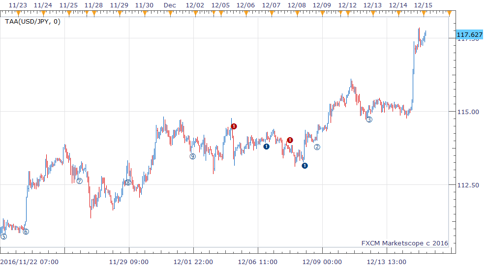

# TAA indicator

> Source: https://fxcodebase.com/code/viewtopic.php?f=17&t=64214  
> Forum: 17 · Topic 64214 · 2 post(s)

---

## TAA indicator

**richardtao** · Thu Dec 15, 2016 4:06 am

The TAA indicator is applying to Trading Station II.
The algorithmic rules of this indicator are:
a) compared moving average to find direction.
b) mark restart as an entry trigger.

The first parameter is "N: Number of periods" which defines the look back periods of base move average, default 0 means by automatic setting.
The second parameter is "M: Number of Multiple" which defines the maximum consecutive triggers in the same direction.
The end of year 2016’s release. Hope this could help.

 [TAA.bin](files/109943/TAA.bin)

 

---

## Re: TAA indicator

**fjasonfx** · Tue Jan 03, 2017 12:15 am

Hi Richard,

Are you planning on making a strategy for your TAA, THL, and TKS indicators?

Kind Regards,

Jason
