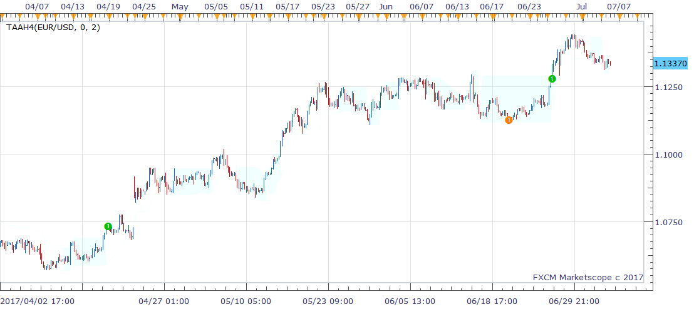

# TAAh4 indicator

> Source: https://fxcodebase.com/code/viewtopic.php?f=17&t=64904  
> Forum: 17 · Topic 64904 · 1 post(s)

---

## TAAh4 indicator

**richardtao** · Thu Jul 06, 2017 1:17 am

The TAAh4 indicator is applying to Trading Station II.
This indicator is tuned with H4 timeframe.
It will display cloud when market on the consolidation.
That could help the selling strategies of the options trading.
On the other hand, the breakout could imply to apply the buying strategies.
The algorithmic rules of this indicator are:
a) measured the price momentum.
b) mark breakout as an entry trigger.

The first parameter is "N: Number of periods" which defines the look back periods of high-low, default 0 means by automatic setting.
The second parameter is "T: Type of strategy" which defines the triggers.
The half year of 2017’s release. Hope this could help.

 [TAAh4.bin](files/113431/TAAh4.bin)
