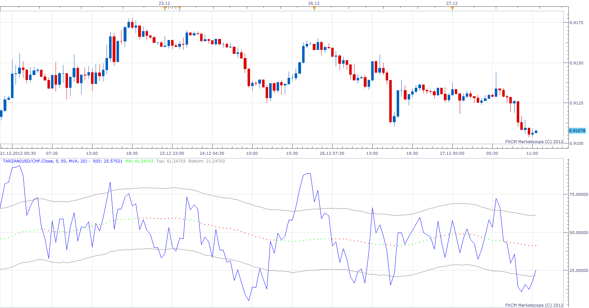

# TARZAN

> Source: https://fxcodebase.com/code/viewtopic.php?f=17&t=27989  
> Forum: 17 · Topic 27989 · 5 post(s)

---

## TARZAN

**Apprentice** · Thu Dec 27, 2012 5:29 am

Basically this is the RSI indicator.
Unlike the standard version,
which has same OB / OS zones values from period to period.
Tarzan Zone values will fluctuate in relation to the central line.
Central line is moving average of RSI.

 [Tarzan.lua](files/49118/Tarzan.lua)

The indicator was revised and updated

---

## Re: TARZAN

**Alexander.Gettinger** · Mon Sep 22, 2014 10:49 am

MQL4 version of Tarzan oscillator: [viewtopic.php?f=38&t=61216](https://fxcodebase.com/code/viewtopic.php?f=38&t=61216).

---

## Re: TARZAN

**Apprentice** · Sat Jun 24, 2017 5:18 am

The indicator was revised and updated.

---

## Re: TARZAN

**rose123** · Sat Jun 24, 2017 11:09 am

hi apprendice ,

can you create a divergence strategy based on this indicator

**buy:**

rsi cross over bottom line
and rsi -bottom cross over rsi level > previous rsi-bottom cross over rsi level
and rsi - bottom cross over price < previous rsi-bottom cross over price

**sell**:

rsi cross under top line
and rsi-top cross under rsi level < previous rsi-top cross under rsi level
and rsi-top cross under price > previous rsi - top cross under price

is it possible to create a divergence strategy like this.

---

## Re: TARZAN

**Apprentice** · Sun Jun 25, 2017 12:54 pm

Try this version.
[viewtopic.php?f=28&t=64840](https://fxcodebase.com/code/viewtopic.php?f=28&t=64840)
