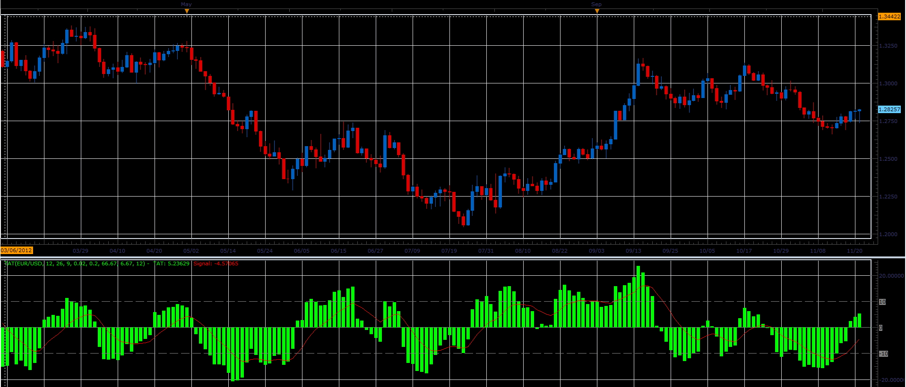

# TAT indicator

> Source: https://fxcodebase.com/code/viewtopic.php?f=17&t=26414  
> Forum: 17 · Topic 26414 · 3 post(s)

---

## TAT indicator

**Alexander.Gettinger** · Wed Nov 21, 2012 12:47 pm

This indicator is a ported indicator from [viewtopic.php?f=27&t=25372](https://fxcodebase.com/code/viewtopic.php?f=27&t=25372)

 

Download:

 [TAT.lua](files/45320/TAT.lua)

The indicator was revised and updated

---

## Re: TAT indicator

**Alexander.Gettinger** · Wed Nov 21, 2012 12:49 pm

MQL4 version of TAT indicator: [viewtopic.php?f=38&t=26415](https://fxcodebase.com/code/viewtopic.php?f=38&t=26415)

---

## Re: TAT indicator

**Apprentice** · Mon Apr 17, 2017 7:03 am

Indicator was revised and updated.
