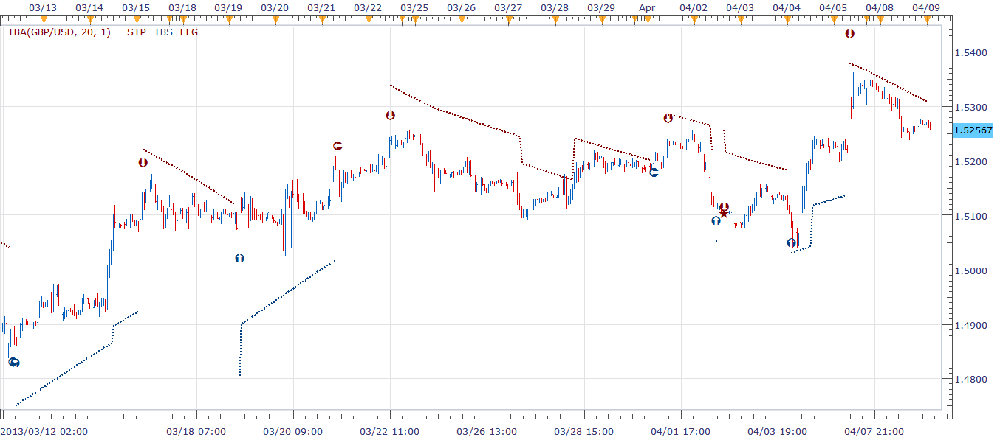

# TBA indicator

> Source: https://fxcodebase.com/code/viewtopic.php?f=17&t=34250  
> Forum: 17 · Topic 34250 · 2 post(s)

---

## TBA indicator

**richardtao** · Tue Apr 09, 2013 3:43 am

The TBA indicator version 2 is applying to Trading Station II.
The indicator nominate as Richard Tao Bands Analysis. This is Richard Tao Predictor serials number 6.

The first parameter is " Number of periods" which defines the periods to setup a pivot Bands.
This version fixed on 20.
The second parameter is " Type of strategy" which defines the strategy type.
Type 1: imminent strategy.
The line “STP” display the recommend trailing stop.
The relevant strategy posted on TBA_S.
Notice: this indicator is good till 2013/9/30.

 [TBA.bin](files/58427/TBA.bin)

---

## Re: TBA indicator

**Apprentice** · Tue May 09, 2017 6:10 am

Bump Up.
