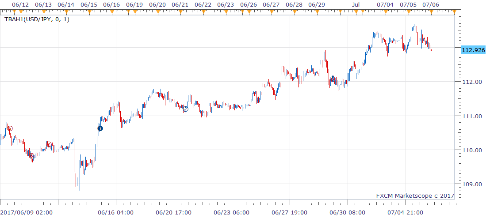

# TBAh1 indicator

> Source: https://fxcodebase.com/code/viewtopic.php?f=17&t=64903  
> Forum: 17 · Topic 64903 · 1 post(s)

---

## TBAh1 indicator

**richardtao** · Thu Jul 06, 2017 1:14 am

The TBAh1 indicator is applying to Trading Station II.
This indicator is tuned with H1 timeframe.
The algorithmic rules of this indicator are:
a) compared moving average to find direction.
b) measured the band.
c) mark pressure as an entry trigger.

The first parameter is "N: Number of periods" which defines the look back periods of trend line, default 0 means by automatic setting.
The second parameter is "T: Type of strategy" which defines the triggers.
This version allows consecutive triggers in the same direction.
The half year of 2017’s release. Hope this could help.

 [TBAh1.bin](files/113430/TBAh1.bin)
