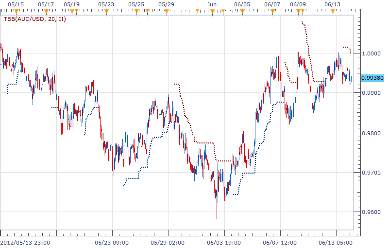

# TBB indicator

> Source: https://fxcodebase.com/code/viewtopic.php?f=17&t=20192  
> Forum: 17 · Topic 20192 · 3 post(s)

---

## TBB indicator

**richardtao** · Thu Jun 14, 2012 5:18 am

The TBB indicator version 1 is applying to Trading Station II.
The indicator nominate as Richard Tao Bollinger Bands Analysis.
This is Richard Tao Predictor serials number 6.

The first parameter is " Number of periods" which defines the periods to setup a pivot Bollinger Bands.
The second parameter is " Type of strategy" which defines the strategy type.
TypeI: reverse strategy.
TypeII: squeeze strategy.
TypeIII: chase after strategy
The line “STP” display the recommend trailing stop.
The relevant strategies posted on TBB_S.

 [TBB.bin](files/35501/TBB.bin)

---

## Re: TBB indicator

**richardtao** · Fri Aug 31, 2012 2:50 am

Here is the TBB indicator enhanced version.
Notice: this indicator is good till 2013/6/30.

The second parameter change to "T: Type of strategy" which defines the strategy type.
1: reverse strategy, 2: imminent strategy, 3: chaseafter strategy
The parameter “Show Line” changes to “Show Signal”.
file of version 2:

 [TBB.bin](files/39417/TBB.bin)

The relevant strategies posted on TBB_S version 2.

---

## Re: TBB indicator

**Apprentice** · Thu Apr 06, 2017 3:50 pm

Bump up.
