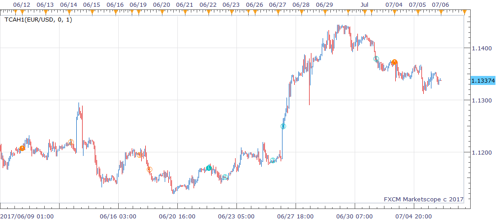

# TCAh1 indicator

> Source: https://fxcodebase.com/code/viewtopic.php?f=17&t=64902  
> Forum: 17 · Topic 64902 · 1 post(s)

---

## TCAh1 indicator

**richardtao** · Thu Jul 06, 2017 1:11 am

The TCAh1 indicator is applying to Trading Station II.
This indicator is tuned with H1 timeframe.
The algorithmic rules of this indicator are:
a) compared cyclic sine wave and stochastic to find direction.
b) mark peak as an entry trigger.

The first parameter is "N: Number of periods" which defines the look back periods of cycle, default 0 means by automatic setting.
The second parameter is "T: Type of strategy" which defines the triggers.
This version allows consecutive triggers in the same direction.
The half year of 2017’s release. Hope this could help.

 [TCAh1.bin](files/113429/TCAh1.bin)
