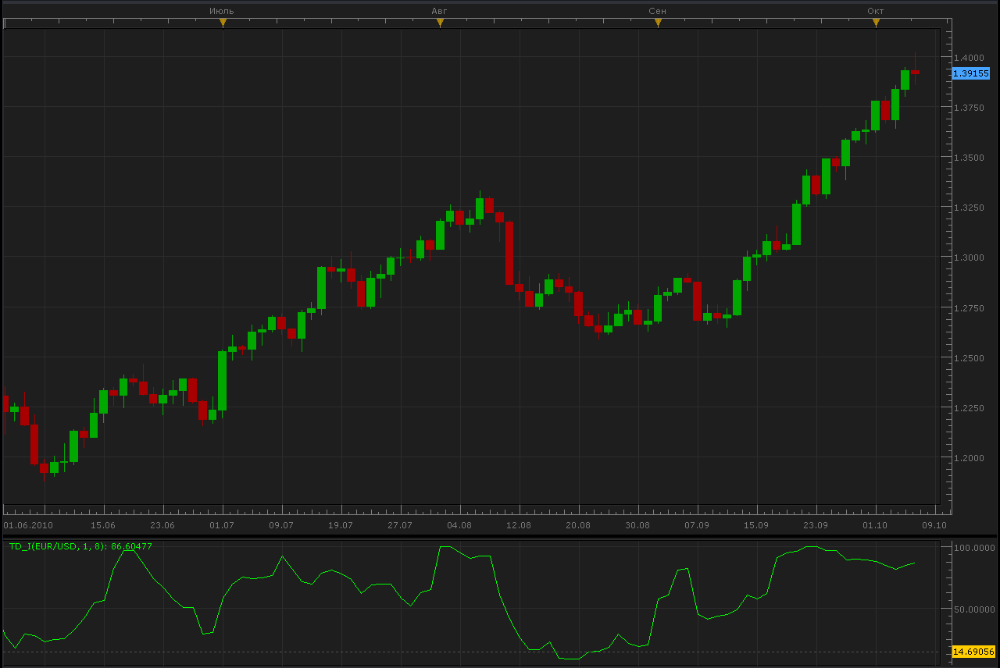

# TD_I indicator

> Source: https://fxcodebase.com/code/viewtopic.php?f=17&t=2359  
> Forum: 17 · Topic 2359 · 2 post(s)

---

## TD_I indicator

**Alexander.Gettinger** · Thu Oct 07, 2010 3:50 pm

Formulas:

high_diff = Max(0, high[now] - high[now-Shift]);
low_diff = Max(0, low[now-Shift] - low[now]);
high_avg = Average(high_diff) from now to now-Period
low_avg = Average(low_diff) from now to now-Period
TD_Ihigh_avg / (high_avg + low_avg) * 100;

 

The indicator was revised and updated

 [TD_I.lua](files/5077/TD_I.lua)

MT4 / MQ4 version.
[viewtopic.php?f=38&t=64092](https://fxcodebase.com/code/viewtopic.php?f=38&t=64092)

---

## Re: TD_I indicator

**Apprentice** · Fri Jan 27, 2017 4:14 am

Indicator was revised and updated.
