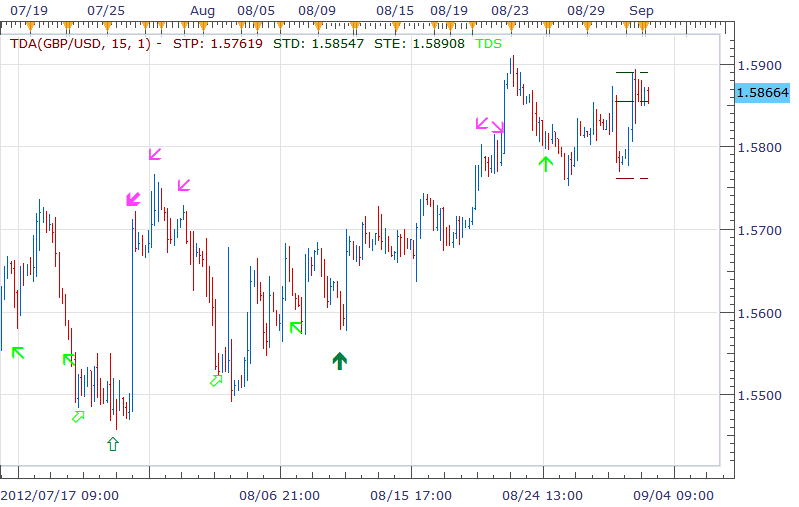
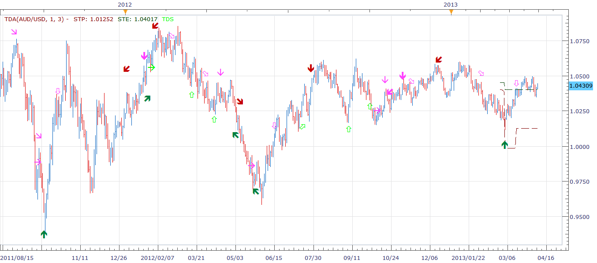

# TDA indicator

> Source: https://fxcodebase.com/code/viewtopic.php?f=17&t=22944  
> Forum: 17 · Topic 22944 · 4 post(s)

---

## TDA indicator

**richardtao** · Mon Sep 03, 2012 3:03 am

The TDA indicator version 1 is name as Richard Tao Dynamic Analysis.
This is Richard Tao Predictor serials number 7.
Notice: this indicator is good till 2013/6/30.

The first parameter is "N: Number of periods " which defines the periods of trend detector.
The second parameter is "T: Type of strategy" which defines the strategy type.
Strategy 1 to 4 is filtered by trend detector. The sensitivity is on the decrease.
Strategy 5 to 7 is not filtered. The sensitivity is on the decrease.
There are some confusing of signal arrows.
The easy way to read those is the direction of arrows represents the guess of next force.
The boldface is higher possibility than normal.
The vertical angle is higher possibility than diagonal.
The signal hollow arrows recommend that the action of square position rather than open position.

The dashed line STP shows recommended stop level.
The dashed line STD shows slight resistance level which may cause little rebound. if price cross this level, it could turn to be a protective stop level.
The dashed line STE shows recommended step level which is the first target of next force. If price cross this level, it means new trend might began.

 [TDA.bin](files/39547/TDA.bin)

---

## Re: TDA indicator

**richardtao** · Fri Feb 22, 2013 5:42 am

there are many people talk about the TD sequential.
as a matter of fact, the TD sequential is one-quarter of the TDA criteria.
depends on sequential only should be awared those can not alert at the on-going trend.
i like to prepare the simple version of showing the last four sequential numbers.
0 represented non perfected in setup serial.
~ represented non qualified in setup serial.
+ represented non perfected in countdown serial.
Notice: this indicator is good till 2013/6/30.

 [TDA_NumberOnly.bin](files/55091/TDA_NumberOnly.bin)

---

## Re: TDA indicator

**richardtao** · Tue Apr 09, 2013 3:54 am

The TDA indicator version 2.
The first parameter is "Type of strategy" which defines the strategy type.
The second parameter is "Classification " which defines the classification of strategy.
This version set as (1,3) for general usage.
The dashed line STP shows recommended stop level.
The line STE shows recommended step level which is the first target of next force. If price cross this level, it means new trend might began.

The relevant strategy posted on TDA_S.
Notice: this indicator is good till 2013/9/30.

 [TDA.bin](files/58429/TDA.bin)

---

## Re: TDA indicator

**Apprentice** · Tue May 09, 2017 6:11 am

Bump up.
