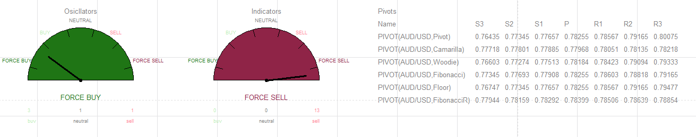

# TECHNICAL ANALYSIS

> Source: https://fxcodebase.com/code/viewtopic.php?f=17&t=65703  
> Forum: 17 · Topic 65703 · 9 post(s)

---

## TECHNICAL ANALYSIS

**Apprentice** · Tue Feb 06, 2018 12:52 pm

Based on.
[viewtopic.php?f=27&t=65689](https://fxcodebase.com/code/viewtopic.php?f=27&t=65689)

 [TECHNICAL ANALYSIS.lua](files/117609/TECHNICAL%20ANALYSIS.lua)

 

 [TECHNICAL ANALYSIS GAUGE.lua](files/117609/TECHNICAL%20ANALYSIS%20GAUGE.lua)

 [TECHNICAL ANALYSIS with Alert.lua](files/117609/TECHNICAL%20ANALYSIS%20with%20Alert.lua)

 [TECHNICAL ANALYSIS GAUGE with Alert.lua](files/117609/TECHNICAL%20ANALYSIS%20GAUGE%20with%20Alert.lua)

---

## Re: TECHNICAL ANALYSIS

**Reymondpolanco** · Tue Feb 06, 2018 1:11 pm

> **Apprentice wrote:**
>
>
> The attachment **EURUSD D1 (02-06-2018 1652).png** is no longer available
>
>
> Based on.
> [viewtopic.php?f=27&t=65689](https://fxcodebase.com/code/viewtopic.php?f=27&t=65689)
>
>
> The attachment **EURUSD D1 (02-06-2018 1652).png** is no longer available

Can you add something like the attached image

---

## Re: TECHNICAL ANALYSIS

**Apprentice** · Thu Feb 08, 2018 6:21 am

Your request is added to the development list under Id Number 4042

---

## Re: TECHNICAL ANALYSIS

**Apprentice** · Thu Feb 08, 2018 7:24 am

Minor improvement

---

## Re: TECHNICAL ANALYSIS

**Apprentice** · Mon Mar 19, 2018 1:36 pm

TECHNICAL ANALYSIS GAUGE.lua added.

---

## Re: TECHNICAL ANALYSIS

**Apprentice** · Mon May 07, 2018 4:55 am

TECHNICAL ANALYSIS with Alert.lua &TECHNICAL ANALYSIS GAUGE with Alert.lua Added.

---

## Re: TECHNICAL ANALYSIS

**Reymondpolanco** · Thu Mar 14, 2019 11:35 pm

Can you add the option to add wich pairs I want to show.

For example if I want the technical analysis for the GBP pairs or any other so i want the option to select all GBP pair in the indicator.

You can put an option in the indicator like Multiple or Single if I select multiple I'm going to chose
GBP/USD
GBP/AUD
GBP/NZD
GBP/CHF
GBP/JPY
GBP/CAD

and the indicator give me a total result for GBP

---

## Re: TECHNICAL ANALYSIS

**Apprentice** · Fri Mar 15, 2019 4:57 am

Your request is added to the development list under Id Number 4541

---

## Re: TECHNICAL ANALYSIS

**Apprentice** · Wed Mar 20, 2019 1:55 pm

Try this version.

 [TECHNICAL ANALYSIS MULTI.lua](files/124824/TECHNICAL%20ANALYSIS%20MULTI.lua)

 [TECHNICAL ANALYSIS GAUGE MULTI.lua](files/124824/TECHNICAL%20ANALYSIS%20GAUGE%20MULTI.lua)
