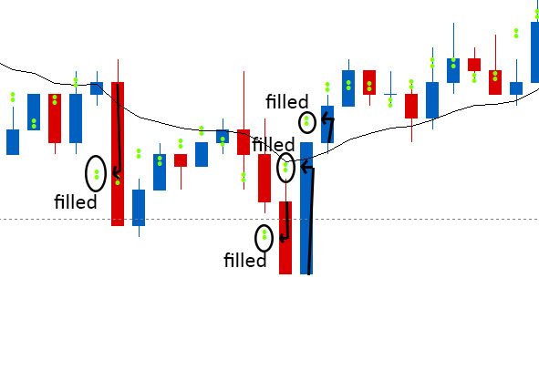

# Temporary Fair Value

> Source: https://fxcodebase.com/code/viewtopic.php?f=17&t=61123  
> Forum: 17 · Topic 61123 · 8 post(s)

---

## Temporary Fair Value

**Apprentice** · Thu Sep 11, 2014 1:46 pm

Based on request.
[viewtopic.php?f=27&t=60903#p94889](https://fxcodebase.com/code/viewtopic.php?f=27&t=60903#p94889)

 [Temporary Fair Value.lua](files/95818/Temporary%20Fair%20Value.lua)

The indicator was revised and updated

---

## Re: Temporary Fair Value

**trendwatch** · Fri Sep 12, 2014 2:10 am

Is it supposed to recalculate after refresh? Because it shows completely different values in real-time. If not set to 0 that is.

---

## Re: Temporary Fair Value

**Apprentice** · Fri Sep 12, 2014 11:31 am

Please Re-Download.

---

## Re: Temporary Fair Value

**Gobelet** · Wed Feb 18, 2015 1:34 pm

Hi guys, I just have a small question : does it repaint for the previous bar or the indicator really see the future ?

Look at the picture below - the fair value of any candel X is almost always filled by the candel X+1, even the most unprobable , far away. Is that the Hlly Graal of scalping ? Maybe it is repainting the past result. In the code there is some story about tick calculation only for present candle and different method for the past candle, right ?

 

---

## Re: Temporary Fair Value

**Apprentice** · Thu Feb 19, 2015 4:00 am

Indicator does not look to the future.
Indicator will be, can also be influenced by Bid / Ask interaction.
Such results will be possible on smaller time frames

---

## Re: Temporary Fair Value

**Gobelet** · Thu Feb 19, 2015 7:21 pm

Hi Apprentice, I look further into it, and it does indeed repaint at the loading of the candels. So only the live results can be used. Let's say, you open a chart at 10:00 am, look at the dots of the indicator for 1hour, take a screenshot. And then you close the chart and reopen it : take another screenshot. The dots will be placed differently on the two screenshots. You can only work with the dots calculated live while the chart is open.

Thanks for all the amazing work you're providing on this website by the way. I'm really impressed by your commitment. Cheers

---

## Re: Temporary Fair Value

**Apprentice** · Tue Aug 08, 2017 5:45 am

The indicator was revised and updated.

---

## Re: Temporary Fair Value

**ahmedalhosenyy** · Thu Mar 21, 2024 8:59 pm

thanks
