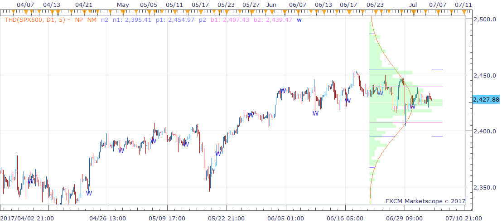

# THD indicator

> Source: https://fxcodebase.com/code/viewtopic.php?f=17&t=64901  
> Forum: 17 · Topic 64901 · 1 post(s)

---

## THD indicator

**richardtao** · Thu Jul 06, 2017 1:07 am

The THD indicator is applying to Trading Station II.
This indicator is dedicated for visualizing the historical from bell shape distribution.
This is design for the options trading. Therefore, familiar with probability is recommended.

The first parameter is "SLA: Select accumulate" which defines the accumulated mode.
The second parameter is "SLB: "Bar size" which defines the historical bar size.
not to use smaller timeframe is recommended.
The third parameter is "SLC: Center for origin" which defines the position as center of origin base point.
The fourth parameter is "SLD: Date for origin" which defines the specific date as center of origin base point. This parameter is effect when SLC set as "Set Date" only.
The fifth parameter is "PTG: Periods of target" which defines the periods of looking forward target.
The sixth parameter is "PCL: %Boundry line" which defines the percentage line.
The half year of 2017’s release. Hope this could help.

 [THD.bin](files/113428/THD.bin)
