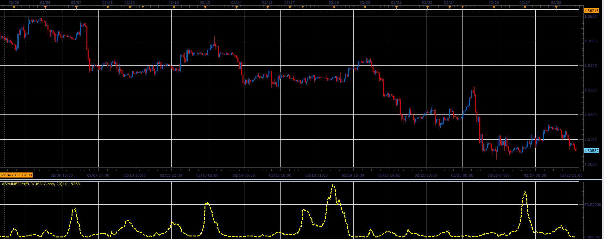

# The asymmetry indicator

> Source: https://fxcodebase.com/code/viewtopic.php?f=17&t=32546  
> Forum: 17 · Topic 32546 · 2 post(s)

---

## The asymmetry indicator

**Alexander.Gettinger** · Thu Feb 28, 2013 5:19 pm

This indicator is a ported MQL5 indicators from [http://www.mql5.com/en/code/1532](http://www.mql5.com/en/code/1532)

 

Download:

 [Asymmetry.lua](files/55440/Asymmetry.lua)

The indicator was revised and updated

---

## Re: The asymmetry indicator

**Apprentice** · Mon May 01, 2017 7:15 am

Indicator was revised and updated.
