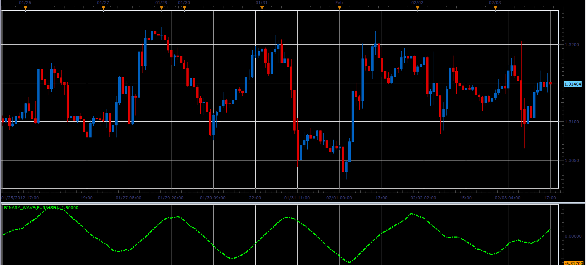

# The Binary Wave

> Source: https://fxcodebase.com/code/viewtopic.php?f=17&t=12833  
> Forum: 17 · Topic 12833 · 4 post(s)

---

## The Binary Wave

**Alexander.Gettinger** · Sat Feb 04, 2012 7:16 pm

This indicator is a ported MQL5 indicator from [http://www.mql5.com/en/code/679](http://www.mql5.com/en/code/679)

 

Download:

 [Binary_Wave.lua](files/25174/Binary_Wave.lua)

For this indicator must be installed AVERAGES indicator ([viewtopic.php?f=17&t=2430](https://fxcodebase.com/code/viewtopic.php?f=17&t=2430)).
For this indicator must be installed MOMENTUM indicator
[viewtopic.php?f=17&t=896&p=100786&hilit=MOMENTUM#p100786](https://fxcodebase.com/code/viewtopic.php?f=17&t=896&p=100786&hilit=MOMENTUM#p100786)

---

## Re: The Binary Wave

**Hailkayy** · Sat Feb 04, 2012 10:03 pm

"Momentum indicator hasn't been found"

---

## Re: The Binary Wave

**Apprentice** · Sun Feb 05, 2012 2:59 am

You need to install Momentum indicator, you can find it here.
[viewtopic.php?f=17&t=896&p=19244&hilit=momentum#p19244](https://fxcodebase.com/code/viewtopic.php?f=17&t=896&p=19244&hilit=momentum#p19244)

---

## Re: The Binary Wave

**Apprentice** · Mon Mar 05, 2018 2:35 pm

The Indicator was revised and updated.
