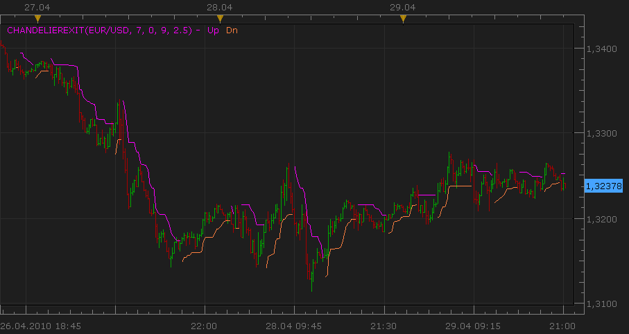

# The Chandelier Exit

> Source: https://fxcodebase.com/code/viewtopic.php?f=17&t=884  
> Forum: 17 · Topic 884 · 14 post(s)

---

## The Chandelier Exit

**Nikolay.Gekht** · Thu Apr 29, 2010 8:29 pm

The Chandelier Exit (developed by Chuck LeBeau) is a volatility measure using the ATR to help set stop limits. The exit is computed by finding the highest value over the period and then subtracting a multiple of the ATR for that period.

 



```lua
-- Indicator profile initialization routine
-- Defines indicator profile properties and indicator parameters
function Init()
    indicator:name("ChandelierExit");
    indicator:description("No description");
    indicator:requiredSource(core.Bar);
    indicator:type(core.Indicator);

    indicator.parameters:addInteger("Range", "Range", "No description", 7);
    indicator.parameters:addInteger("Shift", "No name", "No description", 0);
    indicator.parameters:addInteger("ATRPeriod", "No name", "No description", 9);
    indicator.parameters:addDouble("ATRMultipl", "ATRMultipl", "No description", 2.5);
    indicator.parameters:addColor("Up_color", "Color of Up", "Color of Up", core.rgb(255, 0, 255));
    indicator.parameters:addColor("Dn_color", "Color of Dn", "Color of Dn", core.rgb(255, 128, 64));
end

-- Indicator instance initialization routine
-- Processes indicator parameters and creates output streams
-- Parameters block
local Range;
local Shift;
local ATRPeriod;
local ATRMultipl;

local first;
local ATR;
local source = nil;

-- Streams block
local Up = nil;
local Dn = nil;
local B1, B2, D;

-- Routine
function Prepare()
    Range = instance.parameters.Range;
    Shift = instance.parameters.Shift;
    ATRPeriod = instance.parameters.ATRPeriod;
    ATRMultipl = instance.parameters.ATRMultipl;
    source = instance.source;
    ATR = core.indicators:create("ATR", source, ATRPeriod);
    first = math.max(ATR.DATA:first(), source:first() + Range) + Shift;

    local name = profile:id() .. "(" .. source:name() .. ", " .. Range .. ", " .. Shift .. ", " .. ATRPeriod .. ", " .. ATRMultipl .. ")";
    instance:name(name);
    Up = instance:addStream("Up", core.Line, name .. ".Up", "Up", instance.parameters.Up_color, first);
    Dn = instance:addStream("Dn", core.Line, name .. ".Dn", "Dn", instance.parameters.Dn_color, first);
    B1 = instance:addInternalStream(0, 0);
    B2 = instance:addInternalStream(0, 0);
    D = instance:addInternalStream(0, 0);
end

-- Indicator calculation routine
function Update(period, mode)
    ATR:update(mode);
    if period >= first then
        local atr, hh, ll;

        atr = ATR.DATA[period - Shift] * ATRMultipl;
        ll, hh = core.minmax(source, core.rangeTo(period - Shift, Range));
        B1[period] = hh - atr;
        B2[period] = ll + atr;

        D[period] = D[period - 1];

        if source.close[period] > B2[period - 1] then
            D[period] = 1;
        elseif source.close[period] < B1[period - 1] then
            D[period] = -1;
        end

        if D[period] == 1 then
            if B1[period] < B1[period - 1] then
                B1[period] = B1[period - 1];
            end
            Dn[period] = B1[period];
        elseif D[period] == -1 then
            if B2[period] > B2[period - 1] then
                B2[period] = B2[period - 1];
            end
            Up[period] = B2[period];
        end
    else
        D[period] = 0;
    end
end
```

 [ChandelierExit_SS.lua](files/1617/ChandelierExit_SS.lua)

 [ChandelierExit.lua](files/1617/ChandelierExit.lua)

---

## Re: The Chandelier Exit

**berkoart** · Sat May 01, 2010 10:08 am

`can you explain please what the parameters are?

thanks alot!

---

## Re: The Chandelier Exit

**Nikolay.Gekht** · Sat May 01, 2010 6:59 pm

Range - the number of periods to find highest high and lowest low.
Shift - the number of periods to start the finding high/low and to get ATR value. 0 means from now, 1 from the previous bar and so on.
ATRPeriod - number of periods to calculate ATR
ATRMultipl - a value to multiply ATR result on.

---

## Re: The Chandelier Exit

**re.a.l.** · Wed Sep 28, 2011 10:09 am

Nikolay,

thank you very much for this indicator.

May I ask you to enhance the indicator so that one can modify the line width?

Much thanks in advance.

Regards,
re.a.l.

---

## Re: The Chandelier Exit

**Apprentice** · Wed Sep 28, 2011 1:46 pm

Style Option Added.

---

## Re: The Chandelier Exit

**re.a.l.** · Thu Sep 29, 2011 1:50 am

Apprentice,

"Puno hvala!"

Regards,
re.a.l.

---

## Re: The Chandelier Exit

**Apprentice** · Thu Sep 29, 2011 2:49 am

Nema na čemu.

---

## Re: The Chandelier Exit

**re.a.l.** · Thu Sep 29, 2011 7:54 am

Apprentice,

hopefully you don't mind if I ask for another favor.

Is it also possible to have the same line style like the SAR indicator?

I believe it's much more practical when trailing the stop and determining prior levels bar by bar or if only using the prior value since the current value isn't fixed until the close of the bar.

One could also use two indicators overlayed so that the line and the dots are visible.

Thanks again very much in advance!

Regards,
re.a.l.

---

## Re: The Chandelier Exit

**Apprentice** · Thu Sep 29, 2011 3:35 pm

Your request is added to the developmental cue.

---

## Re: The Chandelier Exit

**pudge71381** · Mon Feb 13, 2012 2:44 pm

Can you create a strategy for this indicator? I would like to open my trades manually, but use the indicator as an exit strategy like it was designed.

---

## Re: The Chandelier Exit

**Apprentice** · Tue Feb 14, 2012 7:07 am

Message to anyone who would write this.
Write both versions, trading, and stop.

---

## Re: The Chandelier Exit

**gondrongmas** · Tue Mar 27, 2012 11:29 am

please, I'm desperate to make strategy based on this indicator. but i can't.
anyone can help?

==============================
the rule is simple:
1.when price breaks upper line, open BUY position

2.if the limit is 0 pips or have not reach the limit price yet, and the price breaks the lower line. than the position will be closed. at the same time, it will open SELL position.

3. vice versa
===============================

sorry for my bad English, thanks

---

## Re: The Chandelier Exit

**Apprentice** · Wed Feb 21, 2018 11:00 am

The Indicator was revised and updated.

---

## Re: The Chandelier Exit

**Apprentice** · Sat Nov 13, 2021 4:10 am

Indicator-based strategy.
[https://fxcodebase.com/code/viewtopic.php?f=31&t=71644](https://fxcodebase.com/code/viewtopic.php?f=31&t=71644)
