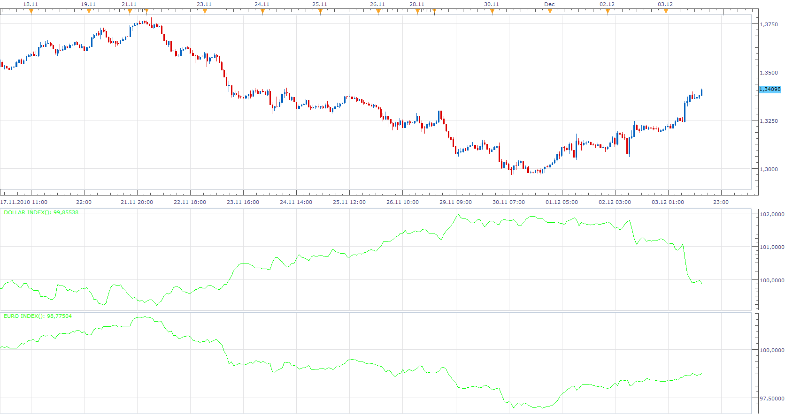
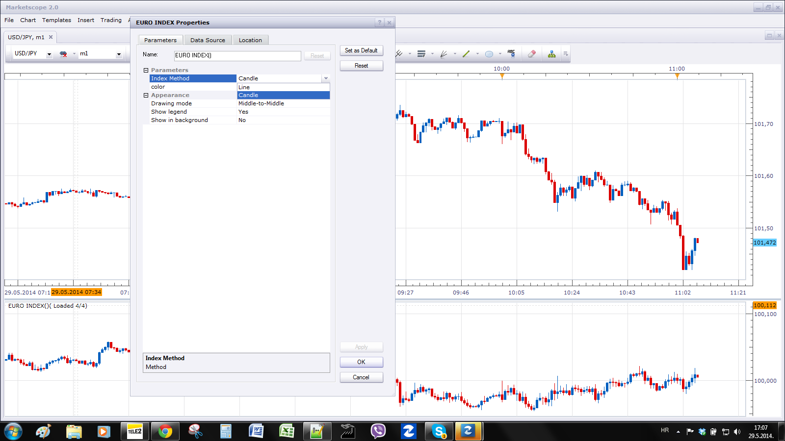

# The Majors Indices

> Source: https://fxcodebase.com/code/viewtopic.php?f=17&t=970  
> Forum: 17 · Topic 970 · 17 post(s)

---

## The Majors Indices

**Apprentice** · Thu May 06, 2010 4:31 am

**First, to emphasize these are not the trade weight currency indeces, rather equal weighted.**

 [Dollar Index.lua](files/1796/Dollar%20Index.lua)

 [Euro Index.lua](files/1796/Euro%20Index.lua)

 [Jen Index.lua](files/1796/Jen%20Index.lua)

 [Pound Index.lua](files/1796/Pound%20Index.lua)

 [Franc Index.lua](files/1796/Franc%20Index.lua)

 [Kiwi Index.lua](files/1796/Kiwi%20Index.lua)

 [Aussie Index.lua](files/1796/Aussie%20Index.lua)

 [Loonie Index.lua](files/1796/Loonie%20Index.lua)

 [NOK Index.lua](files/1796/NOK%20Index.lua)

 [SEK Index.lua](files/1796/SEK%20Index.lua)

To work, you must be subscribed

For Dollar - EUR/USD, USD/JPY, GBP/USD, USD/CHF
For Euro - EUR/USD, EUR/JPY, EUR/GBP, EUR/CHF
For Yen - USD/JPY, EUR/JPY, GBP/JPY, CHF/JPY
For Pound - GBP/USD, EUR/GBP, GBP/JPY, GBP/CHF
For Frank - USD/CHF, EUR/CHF, CHF/JPY, GBP/CHF
For Aussie - "EUR/AUD","AUD/JPY","GBP/AUD","AUD/USD"
For Kiwi - "EUR/NZD","NZD/JPY","AUD/NZD","NZD/USD"
For Loonie - "EUR/CAD","GBP/CAD","USD/CAD","CAD/JPY"
For NOK -"USD/NOK","EUR/NOK","NOK/JPY","CHF/NOK";
For SEK - "USD/SEK","EUR/SEK","SEK/JPY","CHF/SEK"

Due to the limitations of the maximum number of subscribed currency pairs, I limited the number of pairs used in the calculation.

Contact FXCM to enable more than 20 currency pairs for your account.
It does not apply to Demo.

Generic versions
[viewtopic.php?f=17&t=69826](https://fxcodebase.com/code/viewtopic.php?f=17&t=69826)

Normalized versions
[https://fxcodebase.com/code/viewtopic.php?f=17&t=71353](https://fxcodebase.com/code/viewtopic.php?f=17&t=71353)

---

## Re: The Majors Indices

**Apprentice** · Fri Oct 11, 2013 8:08 am

I added Indexes for Aussie, Kiwi & Loonie.

---

## Re: The Majors Indices

**toninvestor** · Tue May 20, 2014 11:24 am

Hi Apprentice,

thanks for all the hard work. Your indicators are very helpful.

I am running the CCY indexes, and have an error when running 3 of them: Franc Index, Jen Index and Kiwi Index. In all of them, the message is the same (only the index name and CCY varies):

"An error occurred during the calculation of the indicator 'FRANC INDEX'. The error details: Franc Index.lua:152: Incorrect instrument name."

Is that a known error?

Thanks

---

## Re: The Majors Indices

**Apprentice** · Tue May 20, 2014 2:47 pm

Please, consult list, of the required currency pairs, for a particular index.
You need to be subscribed to all specified currency pairs.

If 20 subscription limit if a problem.
Ask your FXCM support, to grant you permission of subscription to all currency pairs at once.

---

## Re: The Majors Indices

**toninvestor** · Thu May 22, 2014 12:42 pm

Of course! thanks Apprentice, problem solved.

Is there any possibility of adding NOK and SEK indices?

Thanks again

---

## Re: The Majors Indices

**Apprentice** · Fri May 23, 2014 3:26 am

NOK and SEK indices added.

---

## Re: The Majors Indices

**Daydreaminblue** · Tue May 27, 2014 3:08 pm

Hi,

Would it be possible to add a candlestick mode? One that matches with the same timeframe of the chart.

---

## Re: The Majors Indices

**Apprentice** · Thu May 29, 2014 6:10 am

Candlestick mode Added.
Also i Fix some bugs and boost performance for all above indexes.

---

## Re: The Majors Indices

**Daydreaminblue** · Thu May 29, 2014 9:57 am

Thank you! It is next to perfect.
Would you be able to add all for points for candles; high low open close?
It seems it simply converted the line into candles with 2 points.

---

## Re: The Majors Indices

**Apprentice** · Thu May 29, 2014 10:07 am

Make sure that the Candle option is selected.

Be aware, Candle elements are not based on historical data.
They are calculated from available data for select time frame.
Loading the complete (Tick) price action is just not practical.

---

## Re: The Majors Indices

**Daydreaminblue** · Thu May 29, 2014 10:27 am

I was looking at the Dollar Index. Comparing it to the Euro index on a 4hr, I suppose it's just the Dollar. I realize T chart isn't practical, I don't go below 1 hr for this.

---

## Re: The Majors Indices

**Apprentice** · Tue Dec 22, 2015 3:10 am

Kiwi Index Updated.
GBP/NZD was replaced by AUD/NZD

---

## Re: The Majors Indices

**Apprentice** · Tue Dec 22, 2015 3:12 am

Please let me know if any other index is problematic.

---

## Re: The Majors Indices

**Sharoken** · Mon Dec 05, 2016 7:34 am

Hello,

I would like to know if it is possible to create an indicator with all these currencies index to know the flow and the direction of all the currencies with one indicator.

It would be great to have an indicator who superpose the pound index, jen index, euro index, etc.

Thank you in advance,

Valentin

---

## Re: The Majors Indices

**Apprentice** · Wed Dec 07, 2016 3:32 am

Sure, you can specify the algorithm used.

---

## Re: The Majors Indices

**insigniafx** · Thu May 07, 2020 1:15 pm

Would it be possible to select which pairs to integrate into a given index?

so for example, if i wanted to track only 3pairs - say, e/u + e/j + e/c - it will allow me to customize for only these 3 to load as a OHLC 1minute index.

meaning, the non-weighted index for any (given currency) can be anywhere from 2 pairs upto 7.

This functionality would complete this - already good - tool.

Thank you

---

## Re: The Majors Indices

**Apprentice** · Fri May 08, 2020 8:14 am

Generic versions
[viewtopic.php?f=17&t=69826](https://fxcodebase.com/code/viewtopic.php?f=17&t=69826)
