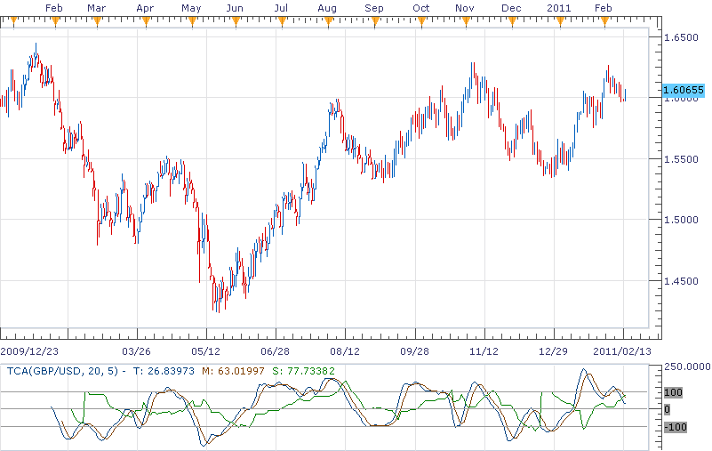

# The TCA indicator

> Source: https://fxcodebase.com/code/viewtopic.php?f=17&t=3393  
> Forum: 17 · Topic 3393 · 11 post(s)

---

## The TCA indicator

**richardtao** · Sun Feb 13, 2011 11:47 pm

The TCA indicator version 1 is applying to Trading Station II.
This Indicator is the slowly predictor which is Adapted Commodity Channel with Trailing Signal. It had a little bit lag of timing sometimes.
The TCA is one of the predictors developed by Richard Tao.

The first parameter is "N: Periods" which defines original CCI periods.
The second parameter is "M: Periods for Smooth" which defines ma periods.
The third parameter is "D: Distance from center" which defines gauging level from 0.
The fourth parameter is "C: Coefficient percentage " which defines the multiplier of change coefficient in percentage.
Personal advice is that N better not to small and the applying timeframe not less than H1.
D1 may use:20,5,100,100; H4:30,5,100,100; H1:50,7,100,100.

The TCA applying rules:
When T crosses up S, signal to buy.
When T crosses down S, signal to sell.

The excellence trader needs to have the ability to forecast trend. To enlarge profit, a trader had better to take position before market move rather than just following.
The general indicator is hard to catch the starting and fading away of the trend in performance. That’s the reason why I built a serial of simple and effective predictors for private use. To use those predictors, a trader needs to a)find the average time span, b)trace it, c)believe it.
Hope this would help.

The indicator was revised and updated

---

## Re: The TCA indicator

**Blackcat2** · Tue Feb 15, 2011 6:51 am

Thanks for sharing this,
What's the recommended TF chart? Can it be used in 15M?

Thanks...
BC

---

## Re: The TCA indicator

**richardtao** · Tue Feb 15, 2011 11:40 pm

hello BC,
basicly it could be use to any timeframe.
i am verify it only on D1,H4,H1 so far.
it need to find the best fitting N in 15m.
i guess it suppose to be greater then 40
for your reference.

---

## Re: The TCA indicator

**richardtao** · Mon Apr 25, 2011 11:46 pm

v1.1 Enhance to distinguish between fast and slow signal.

 [TCA.lua](files/10029/TCA.lua)

---

## Re: The TCA indicator

**BabyDragonFX** · Wed Dec 02, 2015 12:51 pm

Love this indicator! Can line options be added to thicken the lines?

Thank you in advance!

Denny

---

## Re: The TCA indicator

**Apprentice** · Thu Dec 03, 2015 6:11 am

Style option Added.

---

## Re: The TCA indicator

**supertrader123** · Thu Dec 03, 2015 9:55 am

hi apprendice,
may i request a strategy based on this indicator,

buy level: -100
sell level:100

buy:
1. S < BUY LEVEL AND
2.T CROSS OVER S

SELL:
1. S> SELL LEVEL AND
2. T CROSS UNDER S

---

## Re: The TCA indicator

**BabyDragonFX** · Fri Dec 04, 2015 6:22 am

Thank you for adding the style option!!

---

## Re: The TCA indicator

**Apprentice** · Fri Dec 04, 2015 7:00 am

Requested can be found here.
[viewtopic.php?f=31&t=62929](https://fxcodebase.com/code/viewtopic.php?f=31&t=62929)

---

## Re: The TCA indicator

**superleo** · Wed Jul 19, 2017 9:38 pm

hi apprendice

can you create mtf mcp indicator based on this indicator

time frames: h4,d1

parameters: default parameters

buy level: -20
sell level:20

green dot: s< buy level and t>m
red dot: s> sell level and t< m
yellow dot : otherwice.

---

## Re: The TCA indicator

**Apprentice** · Thu Jul 20, 2017 11:02 am

green dot: s< buy level and t>m
red dot: s> sell level and t< m
blue dot : otherwice.

 [MTF MCP TCA List.lua](files/113659/MTF%20MCP%20TCA%20List.lua)
