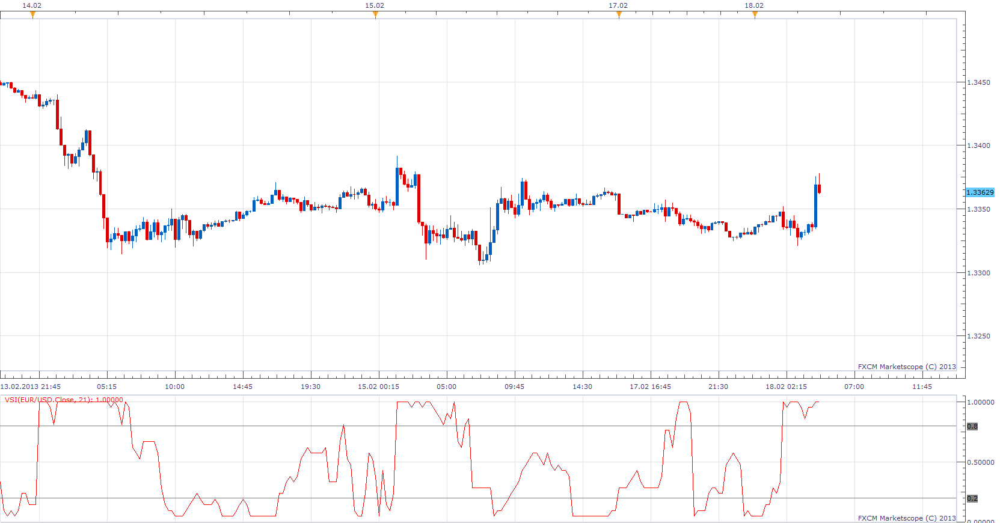

# The Volatility (Regime) Switch Indicator

> Source: https://fxcodebase.com/code/viewtopic.php?f=17&t=32173  
> Forum: 17 · Topic 32173 · 2 post(s)

---

## The Volatility (Regime) Switch Indicator

**Apprentice** · Mon Feb 18, 2013 6:05 am

“The Volatility (Regime) Switch Indicator” as described in February 2013 issue of Technical Analysis of Stocks and Commodities by author Ron McEwan.

 [VSI.lua](files/54846/VSI.lua)

---

## Re: The Volatility (Regime) Switch Indicator

**Apprentice** · Thu Apr 05, 2018 5:56 am

The Indicator was revised and updated.
