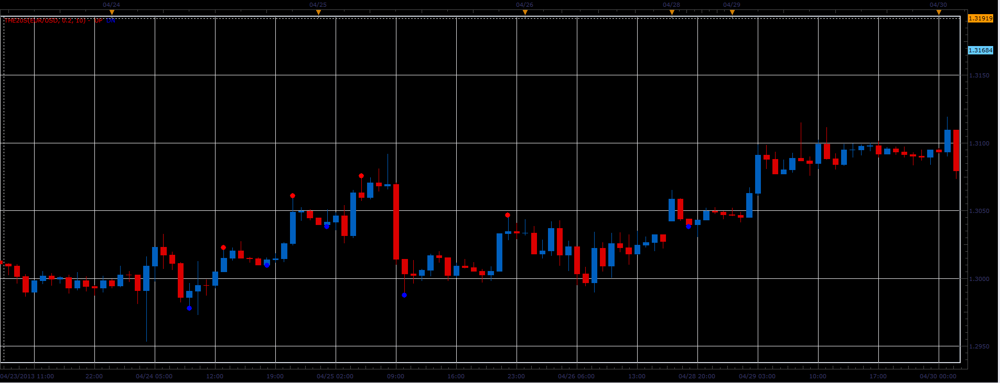

# The20s indicator

> Source: https://fxcodebase.com/code/viewtopic.php?f=17&t=36111  
> Forum: 17 · Topic 36111 · 2 post(s)

---

## The20s indicator

**Alexander.Gettinger** · Tue Apr 30, 2013 4:37 pm

This indicator is ported MQL5 indicator from [http://www.mql5.com/en/code/1612](http://www.mql5.com/en/code/1612)

 

Download:

 [The20s.lua](files/60726/The20s.lua)

The indicator was revised and updated

---

## Re: The20s indicator

**Apprentice** · Thu May 11, 2017 1:41 pm

Indicator was revised and updated.
