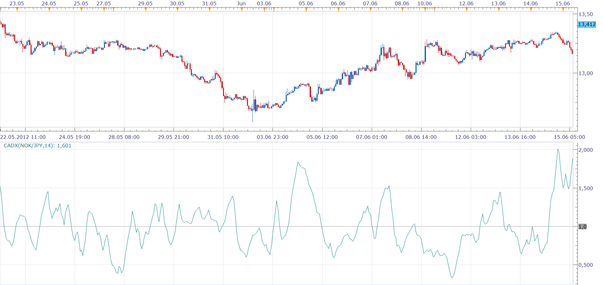

# ThemBonez Comparative ADX

> Source: https://fxcodebase.com/code/viewtopic.php?f=17&t=20428  
> Forum: 17 · Topic 20428 · 4 post(s)

---

## ThemBonez Comparative ADX

**Nikolay.Gekht** · Wed Jun 20, 2012 11:47 am

> **ThemBonez wrote:**
> Investing many approaches using a spreadsheet to track values over the last week, I believe I have solved my Comparative Relative Strength problem in a way that I believe simplifies things greatly.
>
> Using the ADX,
> Divide the currency pair's ADX by the average ADX of the 5 major pairs (EURUSD, GBPUSD, AUDUSD,USDJPY and USD CAD) [I left out USDCHF cause it is historically an inverse of EURUSD.]
>
>
> Formula:
> Current ADX / Average ADX (EURUSD,GBPUSD,AUDUSD,USDJPY,USDCAD)
>
> Then chart that value as an oscillator. Anything over a 1 is a stronger trend than the average...anything below 1 is a weaker trending pair. Also, looking at the currency pair of the strongest to the weakest reveals very strong trends. i.e if the GBPUSD comparitive Relative strength is a 1.5 and the USDJPY is a .5.....looking at the GBPJPY reveals a very strong trend.
>
> It seems to work on any timeframe.

 

Download:

 [CADX.lua](files/35816/CADX.lua)

The indicator was revised and updated

---

## Re: ThemBonez Comparative ADX

**Apprentice** · Tue Oct 15, 2013 2:08 am

Bump Up

---

## Re: ThemBonez Comparative ADX

**Alexander.Gettinger** · Fri Sep 12, 2014 3:34 pm

MQL4 version of oscillator: [viewtopic.php?f=38&t=61131](https://fxcodebase.com/code/viewtopic.php?f=38&t=61131).

---

## Re: ThemBonez Comparative ADX

**Apprentice** · Thu Jun 29, 2017 5:43 am

The indicator was revised and updated.
