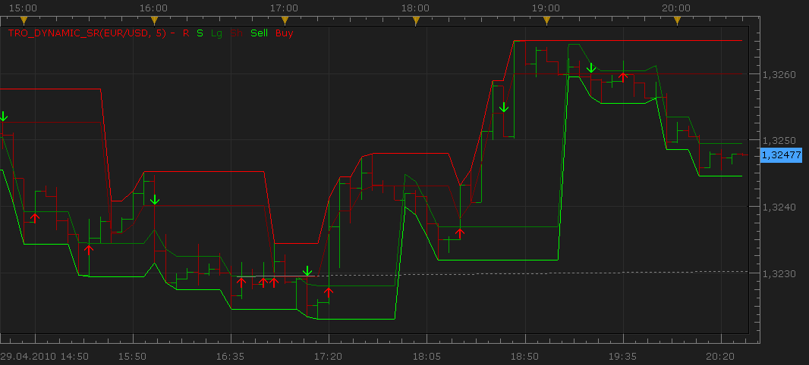
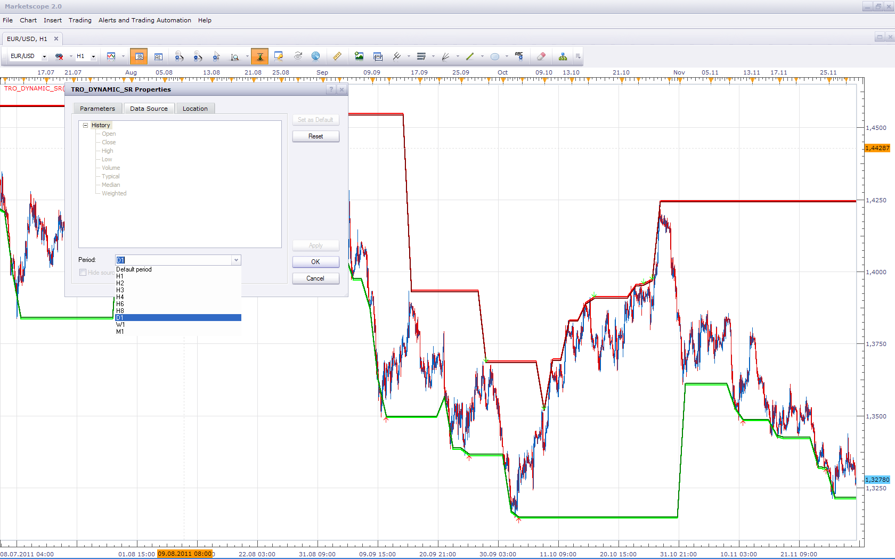

# TheRumpledOne's (TRO's) Dynamic Support/Resistance

> Source: https://fxcodebase.com/code/viewtopic.php?f=17&t=882  
> Forum: 17 · Topic 882 · 19 post(s)

---

## TheRumpledOne's (TRO's) Dynamic Support/Resistance

**Nikolay.Gekht** · Thu Apr 29, 2010 7:34 pm

The indicator is a port of the TheRumpledOne's tro_dynamic_sr indicator.

The original indicator Copyright © 2009, Avery T. Horton, Jr. aka TheRumpledOne
PO BOX 43575, TUCSON, AZ 85733

The original indicator is the donationware and I think that this port must also be. So, if you like this indicator - please donate the TheRumpledOne, the author of the idea.

> **TheRumpledOne wrote:**
> GIFTS AND DONATIONS ACCEPTED
> All my indicators should be considered donationware. That is you are free to use them for your personal use, and are under no obligation to pay for them. However, if you do find this or any of my other indicators help you with your trading then any Gift or Donation as a show of appreciation is gratefully accepted.
>
> The indicator was revised and updated
> Gifts or Donations also keep me motivated in producing more great free indicators.
> PayPal - [[email protected]](https://fxcodebase.com/cdn-cgi/l/email-protection#74203c31262139243831303b3a31343339353d385a373b39)

The indicator generates buy and sell signals. For me it looks a bit noisy, but, from other side, I tested it on various frames and data history and it looks like producing zero-profit-positions in the worst case and some times gives 30-40 pips of profit in both (long and short) directions.

 

Download:

 [tro_dynamic_sr.lua](files/1614/tro_dynamic_sr.lua)

Code: [Select all](https://fxcodebase.com/code/)
`-- +------------------------------------------------------------------+
-- |   TRO_DYNAMIC_FIBS_SR_Trail                                      |
-- |                                                                  |
-- |   Copyright © 2009, Avery T. Horton, Jr. aka TheRumpledOne       |
-- |                                                                  |
-- |   PO BOX 43575, TUCSON, AZ 85733                                 |
-- |                                                                  |
-- |   GIFTS AND DONATIONS ACCEPTED                                   |
-- |   All my indicators should be considered donationware. That is   |
-- |   you are free to use them for your personal use, and are        |
-- |   under no obligation to pay for them. However, if you do find   |
-- |   this or any of my other indicators help you with your trading  |
-- |   then any Gift or Donation as a show of appreciation is         |
-- |   gratefully accepted.                                           |
-- |                                                                  |
-- |   Gifts or Donations also keep me motivated in producing more    |
-- |   great free indicators. :-)                                     |
-- |                                                                  |
-- |   PayPal - [[email protected]](https://fxcodebase.com/cdn-cgi/l/email-protection)                               |
-- +------------------------------------------------------------------+
-- Author's site: http://www.therumpledone.com/

function Init()
    indicator:name("TRO's Dymamic SR");
    indicator:description("");
    indicator:requiredSource(core.Bar);
    indicator:type(core.Indicator);

    indicator.parameters:addInteger("N", "Number of periods", "", 5, 2, 10000);
    indicator.parameters:addInteger("Threshold", "Threshold (in pips)", "", 0, 2, 10000);
    indicator.parameters:addInteger("Trigger", "Trigger value (in pips)", "", 5, 2, 10000);
    indicator.parameters:addBoolean("ShowTriggers", "Show Triggers", "", true);
    indicator.parameters:addBoolean("ResetOnNewDay", "Reset support/resistance on new day", "", false);

    indicator.parameters:addColor("colorR", "Color of resistance", "", core.rgb(255, 0, 0));
    indicator.parameters:addColor("colorS", "Color of support", "", core.rgb(0, 255, 0));
    indicator.parameters:addColor("colorSh", "Color of high trigger", "", core.rgb(127, 0, 0));
    indicator.parameters:addColor("colorLg", "Color of low trigger", "", core.rgb(0, 127, 0));
end

local source;
local N;
local bid;
local ask;
local first;
local Threshold;
local Trigger;
local ResetOnNewDay;
local ShowTriggers;

local DynR;
local DynS;
local LgTrig;
local ShTrig;
local BuySignal;
local SellSignal;
local DayCandle;
local host;
local offset;
local CandleLength;

function Prepare()
    host = core.host;
    offset = host:execute("getTradingDayOffset");
    source = instance.source;
    bid = host:execute("getAskPrice");
    ask = host:execute("getBidPrice");

    local s, e;
    s, e = core.getcandle(source:barSize(), core.now(), 0);
    CandleLength = e - s;

    N = instance.parameters.N;
    Threshold = instance.parameters.Threshold * source:pipSize();
    Trigger = instance.parameters.Trigger * source:pipSize();
    ResetOnNewDay = instance.parameters.ResetOnNewDay;
    ShowTriggers = instance.parameters.ShowTriggers;
    first = source:first() + N;

    local name = profile:id() .. "(" .. source:name() .. ", " .. N .. ")";
    instance:name(name);

    DynR = instance:addStream("R", core.Line, name .. ".R", "R", instance.parameters.colorR, first);
    DynS = instance:addStream("S", core.Line, name .. ".S", "S", instance.parameters.colorS, first);

    if ShowTriggers then
        LgTrig = instance:addStream("Lg", core.Line, name .. ".Lg", "Lg", instance.parameters.colorLg, first);
        ShTrig = instance:addStream("Sh", core.Line, name .. ".Sh", "Sh", instance.parameters.colorSh, first);
        Sell = instance:createTextOutput ("Sell", "Sell", "Wingdings", 10, core.H_Center, core.V_Top, instance.parameters.colorS, 0);
        Buy = instance:createTextOutput ("Buy", "Buy", "Wingdings", 10, core.H_Center, core.V_Bottom, instance.parameters.colorR, 0);
    else
        LgTrig = instance:addInternalStream(first, 0);
        ShTrig = instance:addInternalStream(first, 0);
    end

    DayCandle = instance:addInternalStream(0, 0);
end

function Update(period, mode)
    local candle;
    candle = core.getcandle("D1", source:date(period), offset);
    DayCandle[period] = candle;
    if period >= first then
        if CandleLength < 1 and DayCandle[period - 1] ~= DayCandle[period] and ResetOnNewDay then
            DynR[period] = source.high[period];
            DynS[period] = source.low[period];
        else
            local hh, ll;
            ll, hh = core.minmax(source, core.rangeTo(period, N));
            DynR[period] = hh;
            DynS[period] = ll;
            LgTrig[period] = ll + Trigger;
            ShTrig[period] = hh - Trigger;
            if DynR[period] ~= source.high[period] and DynR[period] < DynR[period - 1] then
                DynR[period] = DynR[period - 1];
                ShTrig[period] = ShTrig[period - 1];
            end
            if DynS[period] ~= source.low[period] and DynS[period] > DynS[period - 1] then
                DynS[period] = DynS[period - 1];
                LgTrig[period] = LgTrig[period - 1];
            end
            local alertBuy, alertSell;
            local green, red;
            alertBuy = LgTrig[period] + Threshold;
            alertSell = ShTrig[period] - Threshold;
            green = (source.open[period] < source.close[period]);
            red = (source.open[period] > source.close[period]);

            local bid1, ask1;
            if period == source:size() - 1 then
                bid1 = bid.close[period];
                ask1 = ask.close[period];
            else
                bid1 = bid.low[period];
                ask1 = ask.high[period];
            end

            if ask1 > alertBuy and source.low[period] <= alertBuy and green then
                if ShowTriggers then
                    Buy:set(period, alertBuy, "\225");
                end
            end
            if bid1 < alertSell and source.high[period] >= alertSell and red then
                if ShowTriggers then
                    Sell:set(period, alertSell, "\226");
                end
            end
        end
    else
        if source:hasData(period) then
            DynR[period] = source.close[period];
            DynS[period] = source.close[period];
            LgTrig[period] = source.close[period] - Trigger;
            ShTrig[period] = source.close[period] + Trigger;
        end
    end
end`

---

## Re: TheRumpledOne's (TRO's) Dynamic Support/Resistance

**Checkz** · Tue Sep 07, 2010 3:46 pm

CAN YOU POST AN UPDATED VERSION OF THIS INDICATOR. THE NAME IS:
THE RUMPLED ONE'S (TRO's) DYNAMIC FIBS S/R.

---

## Re: TheRumpledOne's (TRO's) Dynamic Support/Resistance

**abcdefg** · Thu Nov 04, 2010 8:28 pm

Hi guys,
Can I please request a Bigger TF for this indicator for a tick chart. Highly appreciated and thank you in advance for the great work. I'm not sure, but is it ok to remove the signal arrows and keep the trigger line? If it is too much of a hassle, a bigger frame will do just fine. Thanks again.

=======
**@Nikolay:**It is similar to a Donchian channel, but the trigger line with the option to input different values of pips are very useful.
I agree the signal arrows produces near to zero profits, but the trigger line is very powerful in following the trend.

---

## Re: TheRumpledOne's (TRO's) Dynamic Support/Resistance

**Apprentice** · Fri Nov 05, 2010 3:50 am

Added to developmental cue.

---

## Re: TheRumpledOne's (TRO's) Dynamic Support/Resistance

**thetruth** · Fri Feb 04, 2011 7:42 am

I am using this indicator, i think that the lines produce confusion,
i change the core.Line for core.Dot, i think that looks better.

---

## Re: TheRumpledOne's (TRO's) Dynamic Support/Resistance

**Apprentice** · Wed Nov 30, 2011 3:49 am

Bigger time frame version is now unnecessary.
It is possible to have this, by changing the time frame of the data source.

---

## Re: TheRumpledOne's (TRO's) Dynamic Support/Resistance

**ram123** · Tue Mar 13, 2012 8:38 am

Hi,
is it possible to install an alarm/email alert in this indicator or better
 to make a strategy with possibility for trading.
thanks

---

## Re: TheRumpledOne's (TRO's) Dynamic Support/Resistance

**Apprentice** · Wed Mar 14, 2012 2:51 am

Can you define a trading algorithm, for this strategy.

---

## Re: TheRumpledOne's (TRO's) Dynamic Support/Resistance

**ram123** · Wed Mar 14, 2012 3:28 am

algorithm:
-like indicator(period, TH,TG...)
-execute sell or buy when triggered sell or buy
-ignore the first, 2, 3 ... trigger in the period.
-reset by H,D,M,
+price parameter (m1,m5,...)
+trading parameter (trading y/n, limit, stop, etc.)
+signal parameter (alert, play sound etc)
+email parameter
thanks

---

## Re: TheRumpledOne's (TRO's) Dynamic Support/Resistance

**Hailkayy** · Wed Apr 25, 2012 3:33 pm

Update about strategy requirements.
please base it on the "assymetrical" Tro D S/R (one can still set symetrical settings)

Enter buy trade when buy arrow appears
Enter sell trade when sell arrow appears
Real time Y/N
Close mode Y/N
Filter Y/N
Filter : Trendstop (if Yes activated, strategy will open only short trade when trendstop is above, playing resistance role, and vice versa)
SL
Limit
Limit in candle

---

## Re: TheRumpledOne's (TRO's) Dynamic Support/Resistance

**Apprentice** · Thu Apr 26, 2012 2:17 am

Your request is added to the development list.

---

## Re: TheRumpledOne's (TRO's) Dynamic Support/Resistance

**Apprentice** · Sun May 27, 2012 5:48 am

Indicator is Updated.

---

## Re: TheRumpledOne's (TRO's) Dynamic Support/Resistance

**Hailkayy** · Sun Jun 17, 2012 7:29 pm

Hi man,

please do that, can't wait just drop a basic version man, sell and buy when arrow appears, limit, sl, alert and that'll be good. yeah signal are to be detected real time not end of candle
Drop this by monday tuesday bro.

---

## Re: TheRumpledOne's (TRO's) Dynamic Support/Resistance

**ram123** · Wed Oct 09, 2013 5:36 am

hi,
is it possible to make a strategy for this indicator. please.
so that sells or buys automatically when the indicator gives his signal.
with possibility for setting email,period,limit,stop.
thanks a lot

---

## Re: TheRumpledOne's (TRO's) Dynamic Support/Resistance

**Apprentice** · Wed Oct 09, 2013 2:16 pm

Here you can find the requested strategy.
[viewtopic.php?f=31&t=59633](https://fxcodebase.com/code/viewtopic.php?f=31&t=59633)
Make sure to redownload indicator before using the strategy.
Unfortunately, I was unable to finish Backtesting.
Indicator do not work within Backtester.
Will contact the development team about this issue.
Everything should be OK with live trading.

---

## Re: TheRumpledOne's (TRO's) Dynamic Support/Resistance

**Apprentice** · Mon Jun 12, 2017 6:13 am

The indicator was revised and updated.

---

## Re: TheRumpledOne's (TRO's) Dynamic Support/Resistance

**swnlobo** · Fri Nov 16, 2018 8:36 am

> **Apprentice wrote:**
> The indicator was revised and updated.

Hi,

Could somebody please explain or refer resource for the rationale behind the indicator. It looks like a Donchian Channel but... after the printing of higher highs when does it start to print lower lows on the bears channel?

Thanks in advance

Regards

S.

---

## Re: TheRumpledOne's (TRO's) Dynamic Support/Resistance

**TheRumpledOne** · Sun Oct 06, 2019 1:22 pm

Why are people posting my code when I have asked that my code not be posted.

I do this so you will know where to get the correct, latest and updated version of my code.

[https://youtu.be/pVe07eAT_R4](https://youtu.be/pVe07eAT_R4)

---

## Re: TheRumpledOne's (TRO's) Dynamic Support/Resistance

**Apprentice** · Wed Oct 09, 2019 10:49 am

The code is posted under freeware license section of the forum.
If you're not ready to share, I'll be happy to delete this topic from the forum.
