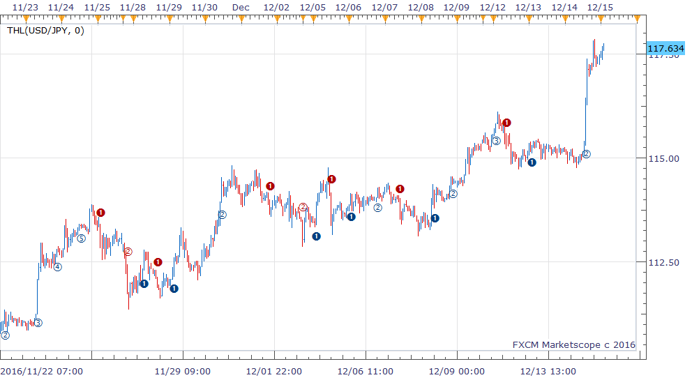

# THL indicator

> Source: https://fxcodebase.com/code/viewtopic.php?f=17&t=64213  
> Forum: 17 · Topic 64213 · 1 post(s)

---

## THL indicator

**richardtao** · Thu Dec 15, 2016 4:03 am

The THL indicator is applying to Trading Station II.
The algorithmic rules of this indicator are:
a) measure the price momentum.
b) eliminate the sideway interference.
c) mark breakout as an entry trigger.

The first parameter is "N: Number of periods" which defines the look back periods of high-low, default 0 means by automatic setting.
The second parameter is "M: Number of Multiple" which defines the maximum consecutive triggers in the same direction.
The end of year 2016’s release. This could be applicable of options seller.

 [THL.bin](files/109942/THL.bin)

 

