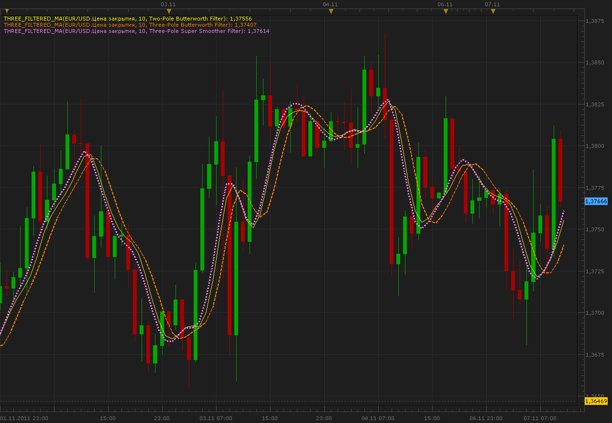

# Three Filtered MA indicator

> Source: https://fxcodebase.com/code/viewtopic.php?f=17&t=7883  
> Forum: 17 · Topic 7883 · 3 post(s)

---

## Three Filtered MA indicator

**Alexander.Gettinger** · Mon Nov 07, 2011 10:43 am

This indicator is a ported MQL5 indicators from [http://www.mql5.com/ru/code/583](http://www.mql5.com/ru/code/583), [http://www.mql5.com/ru/code/584](http://www.mql5.com/ru/code/584) and [http://www.mql5.com/ru/code/589](http://www.mql5.com/ru/code/589) (in Russian).
The indicator uses 3 variants of filtration: two pole Butterworth filter, three pole Butterworth filter and three pole super smoother filter from John Ehlers book "Cybernetic Analysis for Stocks and Futures: Cutting-Edge DSP Technology to Improve Your Trading".

 

Download:

 [Three_Filtered_MA.lua](files/17485/Three_Filtered_MA.lua)

The indicator was revised and updated

---

## Re: Three Filtered MA indicator

**oxfordj** · Wed Nov 16, 2011 8:54 pm

Good evening,

I have been toying with this indicator for a little over a week now. I love MA crossover for their simplicity. I was wondering, could a strategy be developed to buy/sell at a user specified cross?

---

## Re: Three Filtered MA indicator

**Apprentice** · Sun Mar 19, 2017 10:53 am

Indicator was revised and updated.
