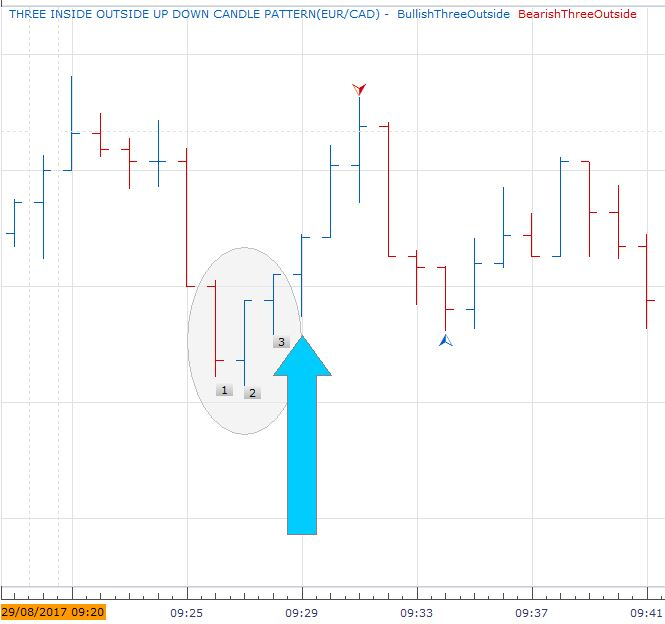
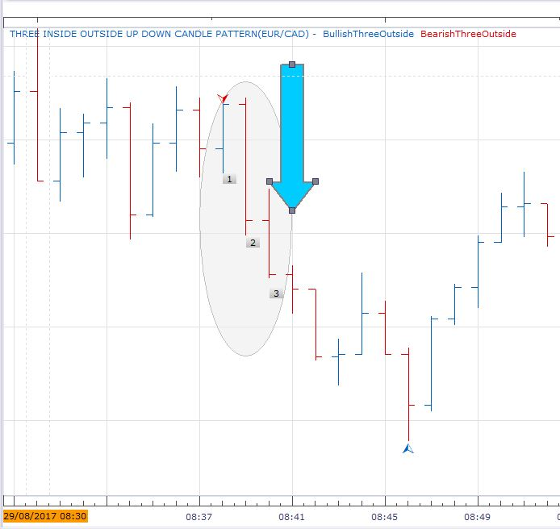
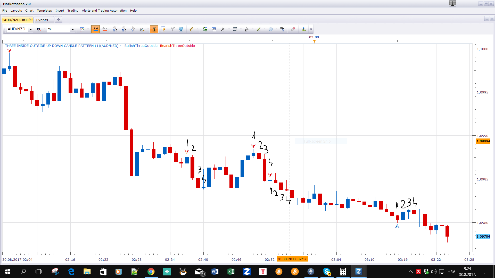

# Three Inside Outside Up Down candle pattern

> Source: https://fxcodebase.com/code/viewtopic.php?f=17&t=65037  
> Forum: 17 · Topic 65037 · 22 post(s)

---

## Three Inside Outside Up Down candle pattern

**Apprentice** · Tue Aug 29, 2017 7:47 am

Based on the request.
[viewtopic.php?f=27&t=65035](https://fxcodebase.com/code/viewtopic.php?f=27&t=65035)

 [Three Inside Outside Up Down candle pattern.lua](files/114551/Three%20Inside%20Outside%20Up%20Down%20candle%20pattern.lua)

 [Three Inside Outside Up Down candle pattern with Alert.lua](files/114551/Three%20Inside%20Outside%20Up%20Down%20candle%20pattern%20with%20Alert.lua)

MT4/MQ4 version.
[viewtopic.php?f=38&t=69167](https://fxcodebase.com/code/viewtopic.php?f=38&t=69167)

---

## Re: Three Inside Outside Up Down candle pattern

**jrichardson83** · Tue Aug 29, 2017 8:12 am

Apprentice,

Can you add an alert function?

---

## Re: Three Inside Outside Up Down candle pattern

**Apprentice** · Tue Aug 29, 2017 8:49 am

Try this strategy.
[viewtopic.php?f=31&t=65038&p=114554#p114554](https://fxcodebase.com/code/viewtopic.php?f=31&t=65038&p=114554#p114554)

---

## Re: Three Inside Outside Up Down candle pattern

**conjure** · Tue Aug 29, 2017 10:59 am

Thank you for your time Apprentice .
Unfortunately it doesnt do what i need it to do.

the Three Outside Up pattern is comprised of three individual candles
The first candle should close down
The second and third candles should close up
If this pattern happens then there should be a buy signal
as shown in the picture

 

and the opposite for Three Outside Down pattern
The first candle should close up
The second and third candles should close down
If this pattern happens then there should be a sell signal

 

Is it possible to modified it?

---

## Re: Three Inside Outside Up Down candle pattern

**Apprentice** · Wed Aug 30, 2017 4:18 am

This is candle index used.
The signal is given on first candle of the pattern, instead of the fourth.

---

## Re: Three Inside Outside Up Down candle pattern

**conjure** · Wed Aug 30, 2017 7:22 am

oooo

---

## Re: Three Inside Outside Up Down candle pattern

**SakyScalping** · Sat Mar 03, 2018 10:16 pm

Hello sir **Apprentice**,is there an update to this indicator
provided that,
the arrow appears at the closing of the candlestick number3, which is lower than the two candles N1 and N2, or, before the closing, as soon as it exceed the candlesticks N1 and N2 ?

---

## Re: Three Inside Outside Up Down candle pattern

**Apprentice** · Sun Mar 04, 2018 6:31 am

This is the last version.

---

## Re: Three Inside Outside Up Down candle pattern

**SakyScalping** · Sun Mar 04, 2018 7:09 pm

ok, please sir Apprentice, what indicators do you recommend for scalping 1minutes?

---

## Re: Three Inside Outside Up Down candle pattern

**Apprentice** · Mon Mar 05, 2018 7:45 am

Unfortunately, I can not help you.
I am a positioning trader.
In my trading, I do not use indicators.

---

## Re: Three Inside Outside Up Down candle pattern

**SakyScalping** · Mon Mar 05, 2018 3:16 pm

sorry

---

## Re: Three Inside Outside Up Down candle pattern

**papynou34** · Wed Mar 14, 2018 6:26 am

Hello,
Is it possible to add an alert when up or Down signal appears?

Thanks a lot.

---

## Re: Three Inside Outside Up Down candle pattern

**Apprentice** · Wed Mar 14, 2018 5:50 pm

Three Inside Outside Up Down candle pattern with Alert.lua

---

## Re: Three Inside Outside Up Down candle pattern

**papynou34** · Thu Mar 15, 2018 5:40 am

Thank you, it is perfect.

---

## Re: Three Inside Outside Up Down candle pattern

**isamegrelo** · Sat Mar 17, 2018 5:35 pm

> **Apprentice wrote:**
> Unfortunately, I can not help you.
> I am a positioning trader.
> In my trading, I do not use indicators.

Are you using stop loss or trailing stop? If yes, how you calculate them?

---

## Re: Three Inside Outside Up Down candle pattern

**Apprentice** · Sun Mar 18, 2018 6:00 am

Based on how much equity I want to risk in a particular trade.
I use Risk To Reward Ratio indicator in the calculation process.
[viewtopic.php?f=17&t=689](https://fxcodebase.com/code/viewtopic.php?f=17&t=689)

---

## Re: Three Inside Outside Up Down candle pattern

**bruno2017** · Thu Aug 16, 2018 11:17 am

ello
Why are there four signals for this indicator because there are only two figures to recognize. I do not understand.
Someone could explain it please
thank

---

## Re: Three Inside Outside Up Down candle pattern

**Apprentice** · Fri Aug 17, 2018 6:23 am

We have
Bullish Three Outside Signal
Bearish Three Outside Signal
Bullish Three Inside Signal
Bearish Three Inside Signal

---

## Re: Three Inside Outside Up Down candle pattern

**bruno2017** · Fri Aug 17, 2018 9:58 am

hello

ok I understood there are four figures.
 thank you very much

---

## Re: Three Inside Outside Up Down candle pattern

**isamegrelo** · Tue Nov 26, 2019 4:19 pm

Can you create this indicator for mt4?

---

## Re: Three Inside Outside Up Down candle pattern

**Apprentice** · Wed Nov 27, 2019 6:00 am

Your request is added to the development list.
Development reference 358.

---

## Re: Three Inside Outside Up Down candle pattern

**Apprentice** · Thu Nov 28, 2019 7:23 am

MT4/MQ4 version.
[viewtopic.php?f=38&t=69167](https://fxcodebase.com/code/viewtopic.php?f=38&t=69167)
