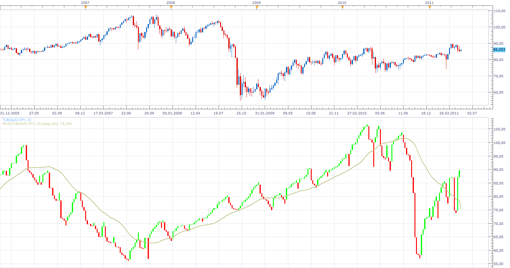
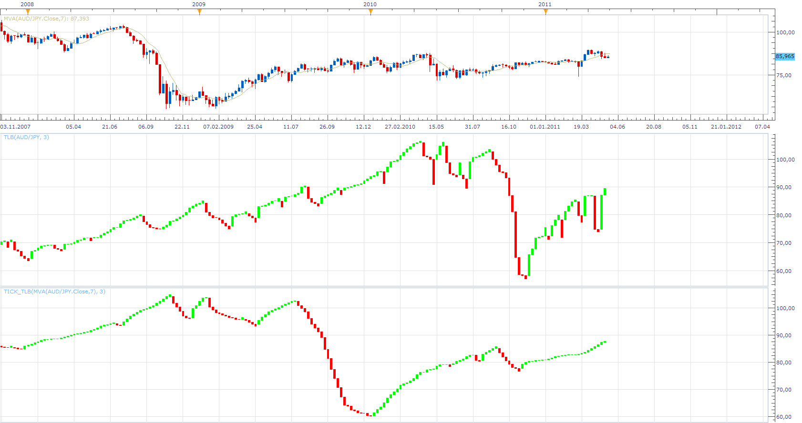

# Three Line Break (OBSOLETE)

> Source: https://fxcodebase.com/code/viewtopic.php?f=17&t=3532  
> Forum: 17 · Topic 3532 · 20 post(s)

---

## Three Line Break (OBSOLETE)

**Apprentice** · Sat Feb 26, 2011 4:22 am

Three Line Break charts display a series of vertical boxes ("lines") that are based on changes in prices. As with Kagi, Point & Figure, and Renko charts, Three Line Break charts ignore the passage of time, and filters price action.

The term "three line break" comes from the criterion that the price has to break the high or low of the previous three lines in order to reverse and create a line of the opposite color.

The Three Line Break Charts are actually Any Line Break Charts.
They are not limited to just a three line reversal.
 You can create Two Line Break Charts, or even Eighteen Line Break Charts, if you wish.

 [TLB.lua](files/8451/TLB.lua)

This indicator is obsolete.
The new version can be found here.
[viewtopic.php?f=17&t=61641](https://fxcodebase.com/code/viewtopic.php?f=17&t=61641)

The indicator was revised and updated

---

## Re: {Three} Line Break (TLB)

**patick** · Mon Feb 28, 2011 6:34 am

I think I understand the logic of the price reversal, but how does it determine when to print a box (same color as previous) when there is a trend?

---

## Re: {Three} Line Break (TLB)

**Apprentice** · Mon Feb 28, 2011 7:34 am

If Price is Higher From Previous One, For Up trend.
And
If Prise is Lower From Previous One, For Down Trend.

---

## Re: {Three} Line Break (TLB)

**isimek** · Mon Mar 14, 2011 11:59 am

Dear friends, it seems the indicator does not behave in expectable way. Please check the screenshot attached th ehuge differences between regular pricea and the prices presented by TLB graph. Thank you.

---

## Re: {Three} Line Break (TLB)

**Apprentice** · Mon Mar 14, 2011 5:04 pm

TLB and regular Price Action have no direct correlation.
Time does not flow linearly for the TLB chart.

You have to ignore the dates shown on the x axis.

More info on TLB.
[http://www.linnsoft.com/tour/threeLineBreakChart.htm](http://www.linnsoft.com/tour/threeLineBreakChart.htm)

---

## Re: {Three} Line Break (TLB)

**isimek** · Wed Apr 13, 2011 3:44 pm

Hi, I would like to present very comfortable look-and-feel of TLB indicator. It is helpful due to tight correlation between real price and indicator candles and due to ability to coexist in the same window with the standard graph (customizable bar width and colors). Thank you.

---

## Re: {Three} Line Break (TLB)

**rob mccrory** · Tue May 17, 2011 10:55 pm

Thanks a lot for this indicator Apprentice!!

I rarely post on boards, but this indicator (for my trading/setups) is one of the best indicators I've seen. Of course, time/trade will tell...but it looks nice non-the-less.

I'm waiting for the market to open to test it out(which will be the real test). Another night-less sleep fine tuning the Line Break prior the the open.

Secondly, is there a way we could eliminate 'some' of the noise the indicator renders....maybe placing a SAMA in there some where.....told ya I don't know my head from my ass when it comes to code

I'm far from a programmer, but I could do some testing for you....and buy you a beer one of these days.

Thanks...
thanks,

rob

---

## Re: {Three} Line Break (TLB)

**bingyunid** · Wed May 18, 2011 3:18 am

---

## Re: {Three} Line Break (TLB)

**Apprentice** · Wed May 18, 2011 3:58 am

I'm not entirely sure what you want to achieve.
Please elaborate into greater detail.

Would you like TLB based on moving average, not price.

I suppose, that you can use the moving average as in this example.
But this is extremely unusual.

TLB is laging indicator.
Using indicators based on it is not recommended.
Most non-linear systems such as P & F used exclusively trend line.

As for beer.
If you will be on the Croatian coast during June or July, contact me.

---

## Re: {Three} Line Break (TLB)

**Apprentice** · Wed May 18, 2011 4:13 am

This is the Tick Based TLB, which can be applied to Tick (single stream data source) like a moving average.
I'll try soon to offer you a version that has moving average incorporate within the indicator.

 [Tick_TLB.lua](files/10793/Tick_TLB.lua)

---

## Re: {Three} Line Break (TLB)

**Apprentice** · Wed May 18, 2011 4:48 am

 [Smoothed TLB.lua](files/10794/Smoothed%20TLB.lua)

---

## Re: {Three} Line Break (TLB)

**trendwatch** · Mon Jul 30, 2012 4:02 am

Hi,

This truly is a great 'indicaotor'. But it seems not to refresh. It does not draw a new candle when it has to do so. I have to change from bid to ask or switch timeframes to have TLB draw the new candle(s). Do you think you can fix this issue?

---

## Re: {Three} Line Break (TLB)

**mulligan** · Thu Mar 21, 2013 7:58 pm

I'm having the same problem as trendwatch posted. With the indicator loaded on the 1 minute chart with data source on default period, I have to constantly refresh as the bars on 'TLB smoothed' freeze up and do not show on the chart unless I do. This is a great indicator. I hope you can help with the problem. Thanks for your assistance.

---

## Re: {Three} Line Break (TLB)

**mulligan** · Tue Apr 02, 2013 10:03 am

I loaded the latest version of Trade Station today. I was hoping the problem with the bars on "smoothed TLB" freezing would be solved (1 minute chart, data source default period). Unfortunately not. I still have to constantly refresh the chart. Is a fix possible or are the indicator and platform just incompatable? Your assistance is appreciated.

---

## Re: {Three} Line Break (TLB)

**Coondawg71** · Sat Mar 29, 2014 12:22 pm

Can we please request a MCP MTF Three Line Break Table List.

I am aware the time frame is not of importance with this particular indicator. Instead of Time Frame options we would replace that with "Line Breaks" for example: 3,4,5,7,14,21. The List would have a simple arrow UP or arrow DOWN for the overall Trend in Line Break bars.

The List would look something like this perhaps:

Daily Chart:

EuroUsd: 3 down, 4 down, 5 down, 7 down, 14 down, 21 up

UsdChf: 3 up, 4 up, 5 up, 7 up, 14 up, 21 down

etc, etc.

Thanks!

sjc

---

## Re: {Three} Line Break (TLB)

**Apprentice** · Sun Mar 30, 2014 3:18 am

Your request is added to the development list.

---

## Re: {Three} Line Break (TLB)

**trendwatch** · Fri Jul 11, 2014 6:58 am

> **trendwatch wrote:**
> Hi,
>
> This truly is a great 'indicaotor'. But it seems not to refresh. It does not draw a new candle when it has to do so. I have to change from bid to ask or switch timeframes to have TLB draw the new candle(s). Do you think you can fix this issue?

Dou you think you can fix it?

---

## Re: {Three} Line Break (TLB)

**K.K.jp** · Fri Dec 26, 2014 1:05 am

Hi, will you develop "Three Line Break (TLB)" View?

---

## Re: {Three} Line Break (TLB)

**Apprentice** · Fri Dec 26, 2014 9:33 am

Requested can be found here.
[viewtopic.php?f=17&t=61641](https://fxcodebase.com/code/viewtopic.php?f=17&t=61641)

---

## Re: Three Line Break (OBSOLETE)

**Apprentice** · Sun Jul 30, 2017 6:35 am

The indicator was revised and updated.
