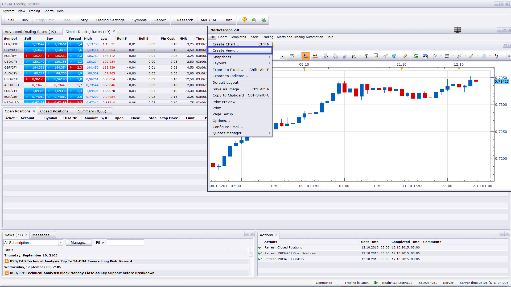

# Three Line Break View

> Source: https://fxcodebase.com/code/viewtopic.php?f=17&t=61641  
> Forum: 17 · Topic 61641 · 10 post(s)

---

## Three Line Break View

**Apprentice** · Fri Dec 26, 2014 9:32 am

Three Line Break charts display a series of vertical boxes ("lines") that are based on changes in prices. As with Kagi, Point & Figure, and Renko charts, Three Line Break charts ignore the passage of time, and filters price action.

The term "three line break" comes from the criterion that the price has to break the high or low of the previous three lines in order to reverse and create a line of the opposite color.

The Three Line Break Charts are actually Any Line Break Charts.
They are not limited to just a three line reversal.
You can create Two Line Break Charts, or even Eighteen Line Break Charts, if you wish.

 [Three Line Break View.lua](files/97880/Three%20Line%20Break%20View.lua)

---

## Re: Three Line Break View

**K.K.jp** · Fri Dec 26, 2014 11:13 am

There is a problem.
Error message appears.
"Three Line Break View.lua:152: attempt to call method 'sizefirst' (a nil value)."

Please correct.

---

## Re: Three Line Break View

**Apprentice** · Fri Dec 26, 2014 2:29 pm

Please Re-Download.

---

## Re: Three Line Break View

**K.K.jp** · Sat Dec 27, 2014 2:22 pm

Thanks Apprentice!

---

## Re: Three Line Break View

**ak_nomiss** · Sun Oct 11, 2015 7:09 pm

how can I load this indicator into chart ? i couldnt find this indicator after I import it .

---

## Re: Three Line Break View

**ak_nomiss** · Sun Oct 11, 2015 7:56 pm

how can I use this indicator, It doesnt show up after I import it into marketscope

---

## Re: Three Line Break View

**Apprentice** · Mon Oct 12, 2015 2:42 am

Please use Create View

---

## Re: Three Line Break View

**jaricarr** · Sun Feb 21, 2016 9:57 pm

Hi Apprentice,
Can you add a simple stochastics strategy to this view with exit on opposite ? please...
Thanks
JariCarr

---

## Re: Three Line Break View

**Apprentice** · Wed Feb 24, 2016 2:45 pm

Your request is added to the development list.

---

## Re: Three Line Break View

**Apprentice** · Fri Oct 19, 2018 4:36 am

The indicator was revised and updated.
