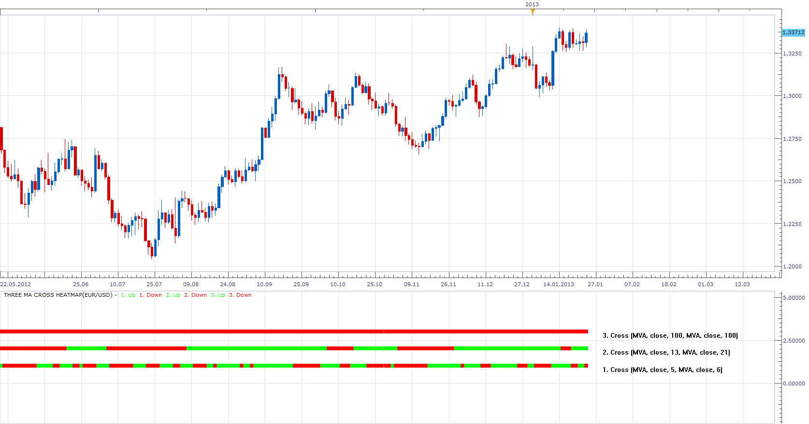

# Three MA Cross Heatmap

> Source: https://fxcodebase.com/code/viewtopic.php?f=17&t=27375  
> Forum: 17 · Topic 27375 · 23 post(s)

---

## Three MA Cross Heatmap

**Apprentice** · Wed Dec 05, 2012 4:16 am

Heatmap showing the conditions of three pairs of moving averages (user defined)

The first row.
Green first MA is above second MA and vice versa

The second row.
Green first MA is above second MA and vice versa

The third row.
Green first MA is above second MA and vice versa

 [Three MA Cross Heatmap.lua](files/47890/Three%20MA%20Cross%20Heatmap.lua)

MT4 version
[https://fxcodebase.com/code/viewtopic.php?f=38&t=72440](https://fxcodebase.com/code/viewtopic.php?f=38&t=72440)

---

## Re: Three MA Cross Heatmap

**irvin_verma** · Wed Jan 23, 2013 7:52 am

hi,

please add zero lag ema to the list of averages of this indicator..
thanku..
irvin.

---

## Re: Three MA Cross Heatmap

**Apprentice** · Wed Jan 23, 2013 8:43 am

Your request is added to the development list.

---

## Re: Three MA Cross Heatmap

**Apprentice** · Thu Jan 24, 2013 4:09 pm

Try Averages Version, Zero Lag EMA is included as well as many other moving averages.

 [Three MA Cross Heatmap.lua](files/53514/Three%20MA%20Cross%20Heatmap.lua)

For this indicator Averages indicator must be installed.
 ([viewtopic.php?f=17&t=2430](https://fxcodebase.com/code/viewtopic.php?f=17&t=2430)).

---

## Re: Three MA Cross Heatmap

**irvin_verma** · Fri Jan 25, 2013 2:25 am

hi,
thanks alotttt for ur great work on ZERO LAG THREE MACROSS HEATMAP..
but i wanted only two values in this like MA_CROSSOVER indicator..
but when i use THREE MACROSS HEATMAP, there are three values are in it.
i wanted only two values. 3rd value is quite confusing and it also resets automatically.
please keep only two values.
1.) MA1 PERIOD
2.) MA2 PERIOS
 and remove periods.

thanks alot.
iRvin.

---

## Re: Three MA Cross Heatmap

**Apprentice** · Fri Jan 25, 2013 4:25 am

Fixed, I add this line by mistake.

---

## Re: Three MA Cross Heatmap

**poriyavt** · Mon Dec 01, 2014 11:40 am

Hi Sir
 i Wanna Make a 1 Indicator same Three MA Cross Heat MApe but i Want in Overlay And I Wanna Some Modify in Indicator like

Buy : When EMA7 > EMA14 and EMA7 > EMA21 and EMA14> EMA21

Sell: When EMA21 > EMA7 and EMA21 > EMA14 and EMA14 > EMA7

When Fast MA Cross Medium MA That time i Want No Trade And When Both Fast & Medium Cross Slow MA That time i Need Signal Trade Buy Or Sell Signal I Hope U Understand What i Want Cozz I Am A little week in english i wait your Reply

Waiting For Your Reply

Regards

---

## Re: Three MA Cross Heatmap

**Apprentice** · Tue Dec 02, 2014 6:55 pm

Your request is added to the development list.

---

## Re: Three MA Cross Heatmap

**Apprentice** · Wed Dec 03, 2014 4:57 am

Try this version.
[viewtopic.php?f=17&t=61569](https://fxcodebase.com/code/viewtopic.php?f=17&t=61569)

---

## Re: Three MA Cross Heatmap

**Apprentice** · Wed Nov 15, 2017 10:02 am

The indicator was revised and updated.

---

## Re: Three MA Cross Heatmap

**Apprentice** · Sun Feb 04, 2018 6:48 am

The Indicator was revised and updated.

---

## Re: Three MA Cross Heatmap

**fx1954** · Sat Jun 06, 2020 5:47 pm

This is a great indicator, however, I woud like to see two improvements
1. there should be an option for shift, to be able to define a crossover with a MA and its displaced one with the same period.
2. There should be an option to take MAs from different timeframes to combine within this indicator, e.g. to combine MAs from 3, 15 and 30 Minutes.
Thank you for your good work.

---

## Re: Three MA Cross Heatmap

**Apprentice** · Sun Jun 07, 2020 7:37 pm

Your request is added to the development list.
Development reference 1433.

---

## Re: Three MA Cross Heatmap

**Apprentice** · Mon Jun 08, 2020 5:20 am

Try this version.

 [Three MA Cross Heatmap.lua](files/134657/Three%20MA%20Cross%20Heatmap.lua)

---

## Re: Three MA Cross Heatmap

**fx1954** · Mon Jun 08, 2020 8:20 am

Thank you, one last thing, could you please give the option to use 3 Minute TFs as well?

---

## Re: Three MA Cross Heatmap

**Apprentice** · Tue Jun 09, 2020 6:06 am

Your request is added to the development list.
Development reference 1441.

---

## Re: Three MA Cross Heatmap

**fx1954** · Tue Jun 09, 2020 10:17 am

I tried, the installation was not possible. I got a error message, see attached file.

---

## Re: Three MA Cross Heatmap

**Apprentice** · Wed Jun 10, 2020 5:04 am

Your request is added to the development list.
Development reference 1453.

---

## Re: Three MA Cross Heatmap

**Apprentice** · Wed Jun 10, 2020 5:32 am

[Three MA Cross Heatmap v2.lua](files/134773/Three%20MA%20Cross%20Heatmap%20v2.lua)

Try this version.

---

## Re: Three MA Cross Heatmap

**fx1954** · Wed Jun 10, 2020 6:26 am

perfect, works very well, thank you.

---

## Re: Three MA Cross Heatmap

**spinemaligna** · Sun May 08, 2022 3:36 am

Dear Apprentice.

I am surprised to see there is no MT4 version of this (unless I have overlooked it somewhere).
Could I ask if an MT4 version is available, if not then could v.2 be recoded to MT4.

Many thanks.

Ross

---

## Re: Three MA Cross Heatmap

**Apprentice** · Tue May 10, 2022 6:34 am

We have added your request to the development list.
Development reference 285.

---

## Re: Three MA Cross Heatmap

**Apprentice** · Wed Jun 29, 2022 7:49 am

Try this version.
[https://fxcodebase.com/code/viewtopic.php?f=38&t=72440](https://fxcodebase.com/code/viewtopic.php?f=38&t=72440)
