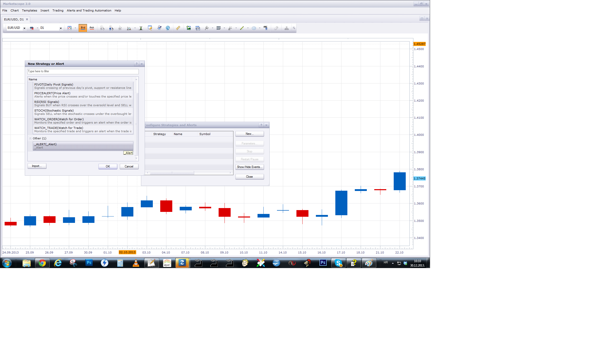
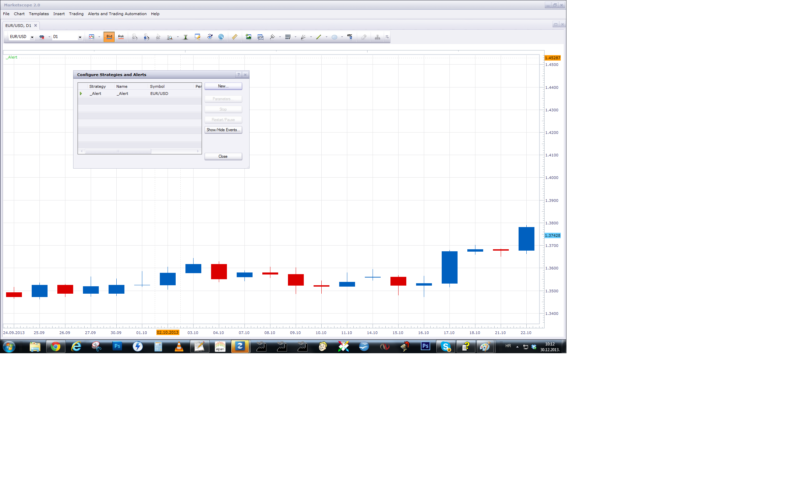

# Thrust Bar

> Source: https://fxcodebase.com/code/viewtopic.php?f=17&t=60137  
> Forum: 17 · Topic 60137 · 8 post(s)

---

## Thrust Bar

**Apprentice** · Sat Dec 21, 2013 2:51 pm

This indicator provides Audio / Email Alerts if candle has achieved a size X times ATR,
 or specified number of pips

 [Thrust Bar.lua](files/91642/Thrust%20Bar.lua)

The indicator was revised and updated

---

## Re: Thrust Bar

**PaulEamonn** · Mon Dec 30, 2013 3:47 am

Hi Apprentice - many thanks for posting a link to this thread from my original request (viewtopic.php?f=27&t=60131&e=0).

I've just tried to install the Thrust Bar indicator and cannot see it in the Indicator list. FYI have installed the _Alert indicator and that can be seen in the Indicator's list.

Can you take a look at this please and see if there is a glitch?

Many thanks.

---

## Re: Thrust Bar

**PaulEamonn** · Mon Dec 30, 2013 3:55 am

Apprentice - Just so as you know, I've just tried to reinstall both indicators and they were both 'Replaced'. So, while the _Alert indicator is in the system and can be seen in the indicator's window, the Thrust Bar indicator is in the system too. It just can't be seen.

Look forward to hearing from you.

Thanks again.

---

## Re: Thrust Bar

**Apprentice** · Mon Dec 30, 2013 4:16 am

After I install Trust indicator it appeared in my Indicator list.

 

After I install Alert Signal/Alert it appeared in my Strategy/Alert list.

 

And finally, I have Alert Helper, on my chart.

First, Alert is not Indicator, it is Helper from Signal / Strategy class.
U have to add it as Signal / Strategy.
Make sure to have one active Alert Helper per pair.

I hope this will clarify things if not contact me tomorrow,
via Skype, will offer some help.

---

## Re: Thrust Bar

**PaulEamonn** · Mon Dec 30, 2013 6:59 am

Hi Apprentice - many thanks for your reply.

The contents of your post showed me where I was going wrong (I'm a newbie to FXCM) and so now I've managed to get it up on my chart. It's exactly what I was looking for. In fact, it's more than I was looking for so thank you very much.

Happy New Year to you and yours.

Thanks again.

---

## Re: Thrust Bar

**Alexander.Gettinger** · Wed Jun 04, 2014 1:12 pm

MQL4 version of Thrust Bar: [viewtopic.php?f=38&t=60767](https://fxcodebase.com/code/viewtopic.php?f=38&t=60767).

---

## Re: Thrust Bar

**Apprentice** · Sun Dec 06, 2015 7:13 am

Compatibility issue fixed.
_Alert Helper is not longer needed.

---

## Re: Thrust Bar

**Apprentice** · Fri Jul 21, 2017 8:58 am

The indicator was revised and updated.
