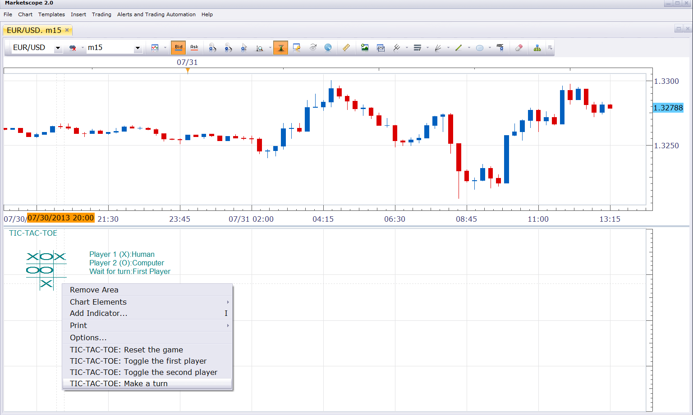

# Tic-Tac-Toe

> Source: https://fxcodebase.com/code/viewtopic.php?f=17&t=58440  
> Forum: 17 · Topic 58440 · 2 post(s)

---

## Tic-Tac-Toe

**Nikolay.Gekht** · Wed Jul 31, 2013 12:48 pm

The indicator is just a simple implementation of 3 by 3 tic-tac-toe game. Right-click and use context menu to make a turn and restart the game.

The indicator just demonstrates some new features introduced for indicators in SDK 2.2, such as custom drawings and an ability to request data from the user at arbitrary moment.

 

Download:

 [tic-tac-toe.lua](files/87602/tic-tac-toe.lua)

The indicator was revised and updated

---

## Re: Tic-Tac-Toe

**Apprentice** · Mon Apr 24, 2017 5:58 am

Indicator was revised and updated.
