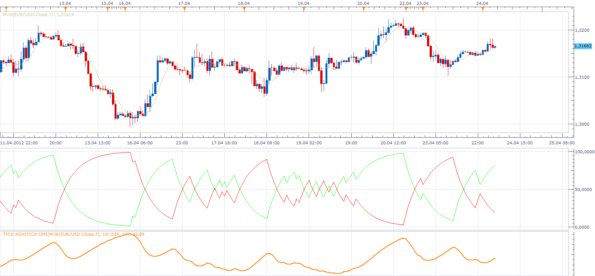
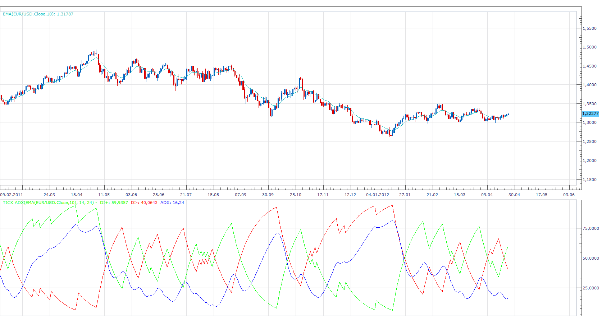

# Tick ADX & Tick DMI

> Source: https://fxcodebase.com/code/viewtopic.php?f=17&t=16809  
> Forum: 17 · Topic 16809 · 11 post(s)

---

## Tick ADX & Tick DMI

**Apprentice** · Tue Apr 24, 2012 4:13 am

These versions can use Tick Data as Source.

 [Tick DMI.lua](files/31015/Tick%20DMI.lua)

 [Tick ADX.lua](files/31015/Tick%20ADX.lua)

 [Tick DMIADX.lua](files/31015/Tick%20DMIADX.lua)

---

## Re: Tick ADX & Tick DMI

**jigsutton** · Tue Apr 24, 2012 5:37 am

That's just what I needed. Works great. Thanks

---

## Re: Tick ADX & Tick DMI

**tma4ever** · Wed Apr 25, 2012 9:20 am

Hi Apprentice,
I have been experimenting on this indicator. I have been getting good results. My request please if you can put an option to overlay Tick DMI.lua on top of each other on the same area with different period options under the data source tab. I really appreciate it. Thanks in advance.

---

## Re: Tick ADX & Tick DMI

**Apprentice** · Thu Apr 26, 2012 2:05 am

Your request is added to the development list.

---

## Re: Tick ADX & Tick DMI

**Apprentice** · Thu Apr 26, 2012 4:28 am

---

## Re: Tick ADX & Tick DMI

**tma4ever** · Fri Apr 27, 2012 6:04 am

Wow, thank you Apprentice.

---

## Re: Tick ADX & Tick DMI

**arindam89** · Wed Sep 26, 2012 9:39 am

> **Apprentice wrote:**
>
>
> adx.png

 great work aprentice
can we have a strategy on this
buy when green line crosses red line upwards
and sell when red line crosses blue line downwards
thanks buy
arindam

---

## Re: Tick ADX & Tick DMI

**arindam89** · Wed Sep 26, 2012 9:42 am

> **Apprentice wrote:**
>
>
> adx.png

sorry wrongly quoted
 buy when green line crosses red line upwards
sell when red line crosses green line upwards
 BOTH UPWARDS
thanks
buy
arindam

---

## Re: Tick ADX & Tick DMI

**Apprentice** · Thu Sep 27, 2012 2:55 am

Requested can be found here.
[viewtopic.php?f=31&t=23859](https://fxcodebase.com/code/viewtopic.php?f=31&t=23859)

---

## Re: Tick ADX & Tick DMI

**Apprentice** · Fri Apr 15, 2016 12:07 pm

Bump Up.

---

## Re: Tick ADX & Tick DMI

**Apprentice** · Mon Sep 03, 2018 8:03 am

The indicator was revised and updated.
