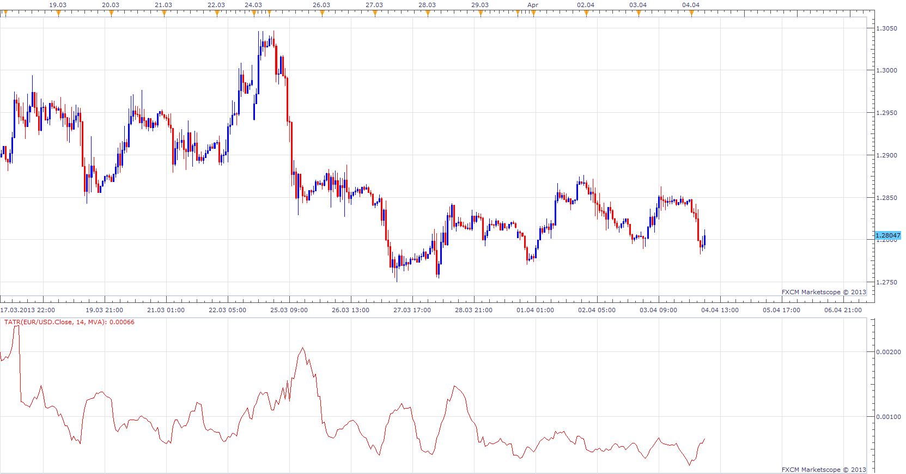

# Tick ATR

> Source: https://fxcodebase.com/code/viewtopic.php?f=17&t=34094  
> Forum: 17 · Topic 34094 · 3 post(s)

---

## Tick ATR

**Apprentice** · Thu Apr 04, 2013 7:03 am

This is a simplified version of the ATR.
So that it can be applied for Tick sources.

Explanation.
**ATR is calculated as.**
Average of True Range (TR).

**True Range can be defined as.**
The larger value of.
1) Current High less the current Low
2) Current High less the previous Close (absolute value)
3) Current Low less the previous Close (absolute value)

**Tick ​​True Range can be defined as.**
Current Close less the previous Close (absolute value)

 [TATR.lua](files/57962/TATR.lua)

The indicator was revised and updated

---

## Re: Tick ATR

**Alexander.Gettinger** · Fri Jun 06, 2014 3:20 pm

MQL4 version of Tick ATR oscillator: [viewtopic.php?f=38&t=60796](https://fxcodebase.com/code/viewtopic.php?f=38&t=60796).

---

## Re: Tick ATR

**Apprentice** · Mon Jun 19, 2017 8:00 am

The indicator was revised and updated.
