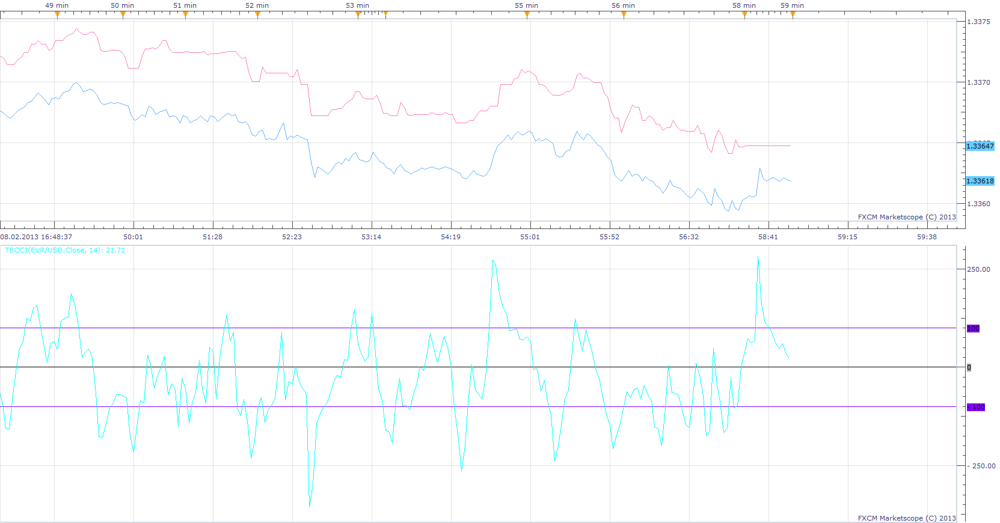

# Tick Based Commodity Channel Index

> Source: https://fxcodebase.com/code/viewtopic.php?f=17&t=31917  
> Forum: 17 · Topic 31917 · 2 post(s)

---

## Tick Based Commodity Channel Index

**Apprentice** · Sun Feb 10, 2013 4:51 am

This is Tick ​​Based Commodity Channel Index that will work on Tick sources, like Tick, Open, Close, Typical...

 [TBCCI.lua](files/54395/TBCCI.lua)

The indicator was revised and updated

---

## Re: Tick Based Commodity Channel Index

**Apprentice** · Mon Jun 19, 2017 7:50 am

The indicator was revised and updated.
