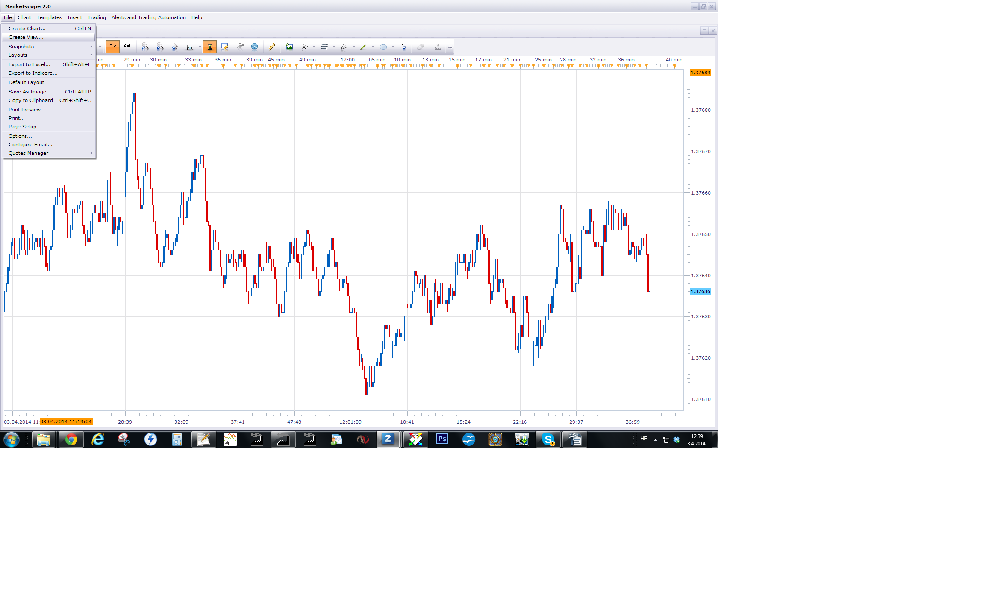
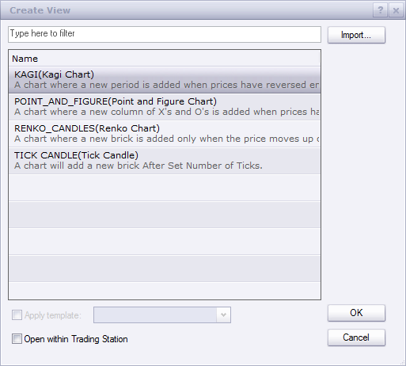

# Tick Candle

> Source: https://fxcodebase.com/code/viewtopic.php?f=17&t=60475  
> Forum: 17 · Topic 60475 · 11 post(s)

---

## Tick Candle

**Apprentice** · Sun Mar 30, 2014 4:14 pm

Duration of standard candle is limited in time.
U can choose between the "m1", "m2" .... "D1", "W1", "M1"

In This View, candle duration is limited by Number of Ticks.
Each candle has the same volume.
For volatile conditions, a greater number of candles will be generated for a given time period.

 [Tick Candle.lua](files/93293/Tick%20Candle.lua)

The indicator was revised and updated

---

## Re: Tick Candle

**gordohogan** · Mon Mar 31, 2014 7:25 am

Thank you so much apprentice! This should work very nicely.

---

## Re: Tick Candle

**tbtrading7** · Wed Apr 02, 2014 2:47 pm

Thanks a bunch for this tool. I'll definitely be spending some time using it. One thing is that I can't get it to update in real time. Any idea why this might be or the setting I can use to make it do this?

---

## Re: Tick Candle

**Apprentice** · Thu Apr 03, 2014 3:05 am

Please Re-Download.

---

## Re: Tick Candle

**BabyDragonFX** · Thu Apr 03, 2014 7:54 am

It does not show up in my indicator list... Please help!

---

## Re: Tick Candle

**gordohogan** · Thu Apr 03, 2014 1:17 pm

Its not an indicator but rather a view. To use it, go to file, create view, then choose it from the list.

Thank you again apprentice it works well, the only problem is it is extremely limited on how far back you can view it. You might get an hour or 2 back, depending on market volatility. Is there any way we can fix this?

Please let me know.

Thanks

---

## Re: Tick Candle

**Apprentice** · Fri Apr 04, 2014 1:09 am

 

---

## Re: Tick Candle

**Apprentice** · Fri Apr 04, 2014 2:57 am

As for the limited scope, the development team has promised to add this functionality in future versions.

---

## Re: Tick Candle

**toxxum** · Wed Jul 30, 2014 4:36 am

> **Apprentice wrote:**
> As for the limited scope, the development team has promised to addd this functionality in future versions.

Awesome - that is what I have been missing ever since I switched from Dukascopy to FXCM! Is there any feedback from the development team when a longer look-back period will be supported?

---

## Re: Tick Candle

**Valeria** · Thu Jul 31, 2014 12:33 am

Hi toxxum,

Support of a longer look-back period will be added in one of the future releases, maybe by the end of the year.

---

## Re: Tick Candle

**Apprentice** · Tue Jul 11, 2017 1:59 pm

The indicator was revised and updated.
