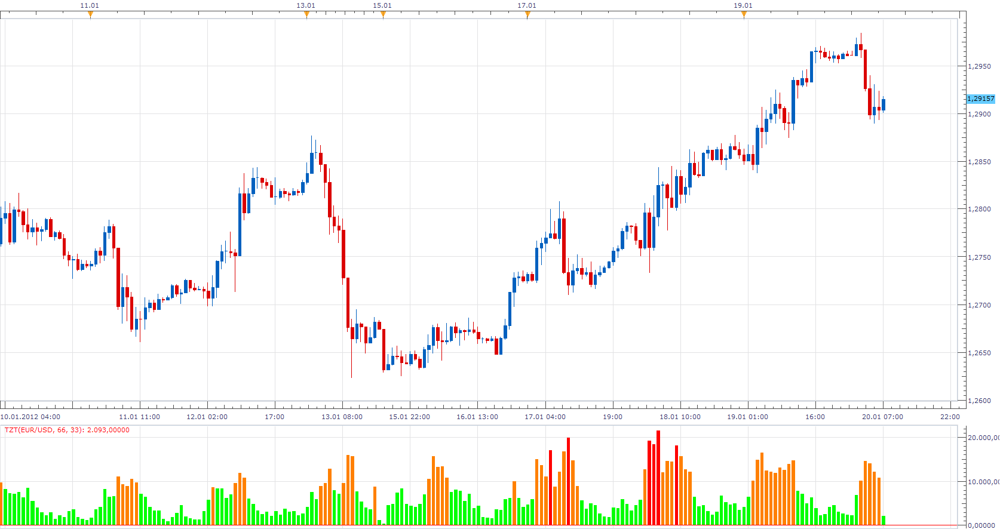

# Tick Thermometer (Tick Volume VU Meter)

> Source: https://fxcodebase.com/code/viewtopic.php?f=17&t=11732  
> Forum: 17 · Topic 11732 · 8 post(s)

---

## Tick Thermometer (Tick Volume VU Meter)

**Apprentice** · Sun Jan 15, 2012 3:20 pm

With this indicator you can compare Tick, volatility,
for, any time frame, currency pair.
Supports absolute and relative type of calculation.
Absolute
Compares the volatility of all selected pairs/ time frames.
Relative
Compares the volatility of a particular currency pair, based on historical data.

 [Tick Thermometer.lua](files/23506/Tick%20Thermometer.lua)

Ticks Zone Histogram

 

Ticks Zone Histogram gives a historical overview.
The user can define a zone as a percentage (relative)
as a reference, we take highest volume in the period.
Or as an arbitrary number of Ticks (absolute)

 [TZH.lua](files/23506/TZH.lua)

The indicator was revised and updated

---

## Re: Tick Thermometer

**arindam89** · Mon Jan 16, 2012 3:19 am

> **Apprentice wrote:**
>
>
> Ticks Thermometer.png
>
>
> With this indicator you can compare Tick, volatility,
> for, any time frame, currency pair.
> Supports absolute and relative type of calculation.
> Absolute
> Compares the volatility of all selected pairs/ time frames.
> Relative
> Compares the volatility of a particular currency pair, based on historical data.
>
>
> Tick Thermometer.lua

hi
thanks for the indicator great work
never though you could make it
can u make the macd strategy time frame change according to the relative percentage change of the tick thermometer
thbaks
by

---

## Re: Tick Thermometer

**Apprentice** · Mon Jan 16, 2012 3:50 am

The only thing I'm sure I do not understand your request.
Do you want to use the indicator VU Meter,
to show the relative, absolute position of the MACD?

---

## Re: Tick Thermometer

**arindam89** · Mon Jan 16, 2012 4:14 am

> **Apprentice wrote:**
> The only thing I'm sure I do not understand your request.
> Do you want to use the indicator VU Meter,
> to show the relative, absolute position of the MACD?

yes

---

## Re: Tick Thermometer (Tick Volume VU Meter)

**Apprentice** · Mon Jan 16, 2012 5:53 am

Requested can be found here.
[viewtopic.php?f=17&t=11772](https://fxcodebase.com/code/viewtopic.php?f=17&t=11772)

---

## Re: Tick Thermometer (Tick Volume VU Meter)

**Apprentice** · Fri Jan 20, 2012 7:13 am

Ticks Zone Histogram Added.

---

## Tick Thermometer Tick Volume VU Meter

**Anariamic** · Tue Jan 24, 2012 11:28 pm

I congratulate, what excellent message.

---

## Re: Tick Thermometer (Tick Volume VU Meter)

**Apprentice** · Wed Mar 29, 2017 11:38 am

Indicator was revised and updated.
