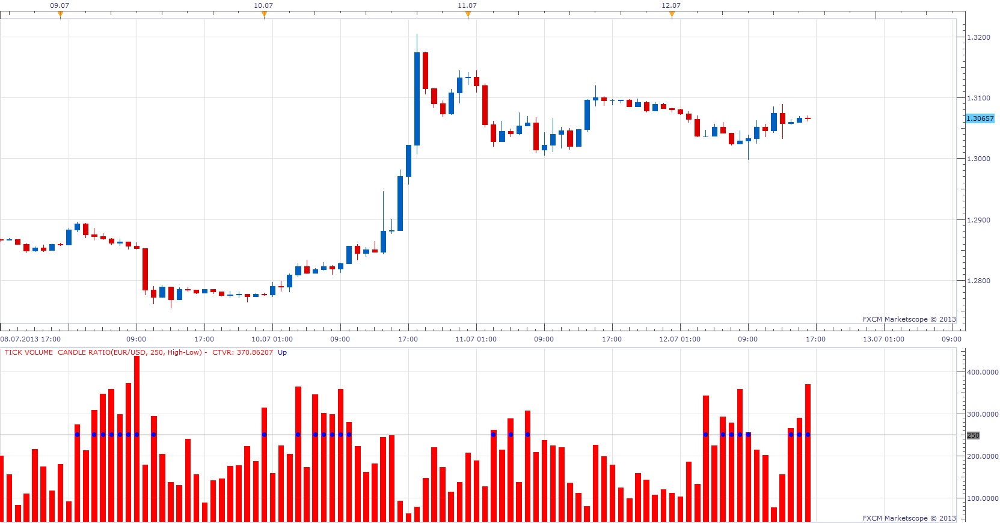

# Tick Volume / Candle Ratio

> Source: https://fxcodebase.com/code/viewtopic.php?f=17&t=51524  
> Forum: 17 · Topic 51524 · 5 post(s)

---

## Tick Volume / Candle Ratio

**Apprentice** · Sun Jul 14, 2013 4:18 am

Tick Volume / Candle Ratio will show Tick Volume / Candle height in pips

This indicator provides Audio / Email Alerts if and when Ratio cross over set Level.

 [Tick Volume Candle Ratio.lua](files/78701/Tick%20Volume%20Candle%20Ratio.lua)

The indicator was revised and updated

---

## Re: Tick Volume / Candle Ratio

**didoda** · Sun Jul 14, 2013 4:36 am

Great work

---

## Re: Tick Volume / Candle Ratio

**didoda** · Sun Jul 14, 2013 6:29 am

Only other some things, when U can
- Possibility to choose from bars, or line
- 2 alert levels
- Possibility to place indicator in the price chart, is necessary to different scale on Y axys I think
AN IMOPORTANT IMPLEMENTATION

LAST 2 CANDLES ARE GREEN
- WHEN THE NEXT CANDLE CLOSE IS HIGHER THAN PRESENT CANDLE CLOSE AND TVCR IN LESS THAN THE PRESENT CANDLE, DO NOTHIN'
- WHEN THE NEXT CANDLE CLOSE IS HIGHER THAN PRESENT CANDLE CLOSE AND TVCR IN BIGGER THAN THE PRESENT CANDLE , MAKE A DOT
- WHEN THE NEXT CANDLE CLOSE IN LOWER THAN PRESENT CANDLE CLOSE AND TVCR IN BIGGER THEN THE PRENDENT CANDLE, MAKE A DOWN ARROW

LAST 2 CANDLES ARE RED
- WHEN THE NEXT CANDLE CLOSE IS LOWER THAN THE PRENSENT CANDLE CLOSE AND TVCR IS LESS THAN THE PRESENT CANDLE, DO NOTHIN'
- WHEN THE NEXT CANDLE CLOSE IS LOWER THAN THE PRENSET CANLDLE CLOSE AND TVCR IS BIGGER THAN THE PRESENT CANDLE MAKE A DOT
- WHEN THE NEXT CANDLE CLOSE IS HIGHER THAN THE PRESENT CANDLE, AND TVCR IS BIGGER THEN THE PRESENT CANDLE, MAKE A GREEN ARROW

Thank's a lot

---

## Re: Tick Volume / Candle Ratio

**Apprentice** · Sun Dec 06, 2015 7:23 am

Compatibility issue fixed.
_Alert Helper is not longer needed.

---

## Re: Tick Volume / Candle Ratio

**Apprentice** · Fri Jul 21, 2017 8:53 am

The indicator was revised and updated.
