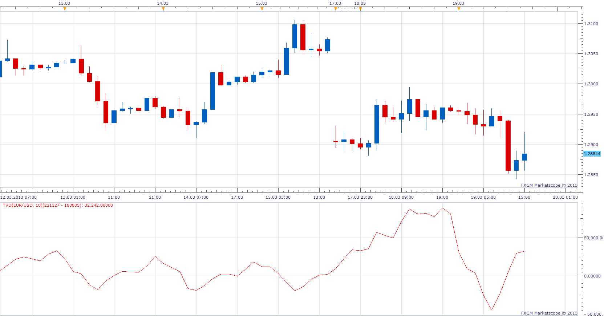

# Tick Volume Difference

> Source: https://fxcodebase.com/code/viewtopic.php?f=17&t=33549  
> Forum: 17 · Topic 33549 · 2 post(s)

---

## Tick Volume Difference

**Apprentice** · Tue Mar 19, 2013 4:59 pm

Originals request was bit trivial.
Calculate the difference between the current Tick Volume, and previous Tick Volume.
U can achieve this if u use Period 1

So I've expanded the definition.
Calculate the difference between the sum of the last N Tick Volume Periods,
and the sum of N Tick Volume which preceded this period

 [TVD.lua](files/56924/TVD.lua)

The indicator was revised and updated

---

## Re: Tick Volume Difference

**Apprentice** · Wed May 10, 2017 5:48 am

Indicator was revised and updated.
