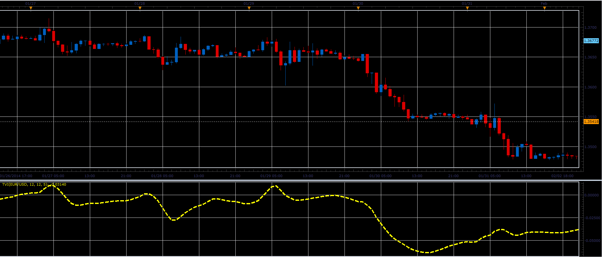

# Tick volume indicator

> Source: https://fxcodebase.com/code/viewtopic.php?f=17&t=60361  
> Forum: 17 · Topic 60361 · 2 post(s)

---

## Tick volume indicator

**Alexander.Gettinger** · Thu Feb 27, 2014 10:33 am

This indicator is a ported MQL5 indicator from: [http://www.mql5.com/en/code/1919](http://www.mql5.com/en/code/1919).

Formulas:
TVI = EMA(TV), where
TV = 100*(EMA_Up2-EMA_Dn2)/sum,
EMA_Up2 = EMA(EMA(UpTicks)),
EMA_Dn2 = EMA(EMA(DnTicks)),
UpTicks = (Volume+(Close-Open)/pipSize)/2,
DnTicks = Volume-UpTicks,
pipSize - size of 1 pip.

 

Download:

 [TVI.lua](files/92922/TVI.lua)

The indicator was revised and updated

---

## Re: Tick volume indicator

**Apprentice** · Fri Jun 02, 2017 6:37 am

Indicator was revised and updated.
