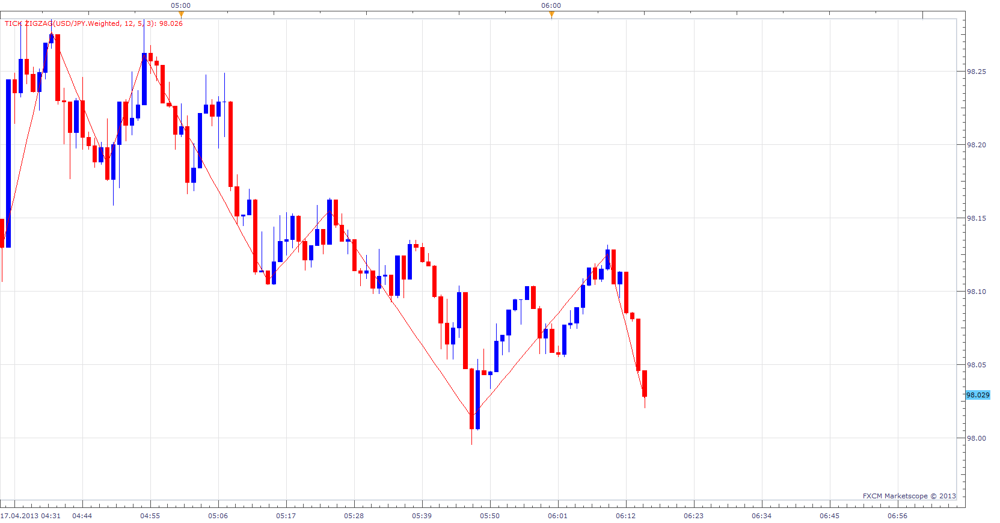

# Tick ZigZag

> Source: https://fxcodebase.com/code/viewtopic.php?f=17&t=34791  
> Forum: 17 · Topic 34791 · 10 post(s)

---

## Tick ZigZag

**Apprentice** · Wed Apr 17, 2013 6:34 am

This Zig Zag indicator will use Tick (open, close, high ...), not Bar, as a source.

 [Tick ZigZag.lua](files/59189/Tick%20ZigZag.lua)

The indicator was revised and updated

---

## Re: Tick ZigZag

**Paul W** · Fri Jun 14, 2013 5:39 pm

I added 3 Tick ZigZag indicators to a Tick Chart – slow, medium and fast.

The attached Chart is a CFD. You will need to slow the indicators more for FX pairs – higher tick volume.

You will see the fast indicator follow price, then medium, and then slow. When all three link into an apex, and begin to reverse, then this is may indicate a price pivot.

I use the CCI dots indicator to verify, and have placed an overlay of the CCI signal from the 1 minute Chart onto the Tick Chart attachment example.

I hope this helps.

---

## Re: Tick ZigZag

**speakinmymind** · Mon Aug 04, 2014 11:55 pm

Could you please allow the change of line size? Thanks

---

## Re: Tick ZigZag

**Apprentice** · Tue Aug 05, 2014 4:00 am

Style Option Added.

---

## Re: Tick ZigZag

**Paul W** · Sat Aug 23, 2014 11:29 am

could you add a simple sound alert feature - repaints ok

thanks

---

## Re: Tick ZigZag

**Apprentice** · Sun Aug 24, 2014 4:25 am

What will trigger the alert?
ZigZag direction changes?

---

## Re: Tick ZigZag

**Paul W** · Sun Aug 24, 2014 10:15 am

Each time the routine calls for a line to be drawn - and may include extending the current line direction (higher highs, lower lows) or a change in direction.

Thanks,

---

## Re: Tick ZigZag

**Apprentice** · Mon Aug 25, 2014 2:20 am

Your request is added to the development list.

---

## Re: Tick ZigZag

**volnmar** · Thu Nov 06, 2014 8:45 am

after few second indicator shut down.... error....settings 2,10,1

---

## Re: Tick ZigZag

**Apprentice** · Tue Jun 27, 2017 3:52 am

The indicator was revised and updated.
