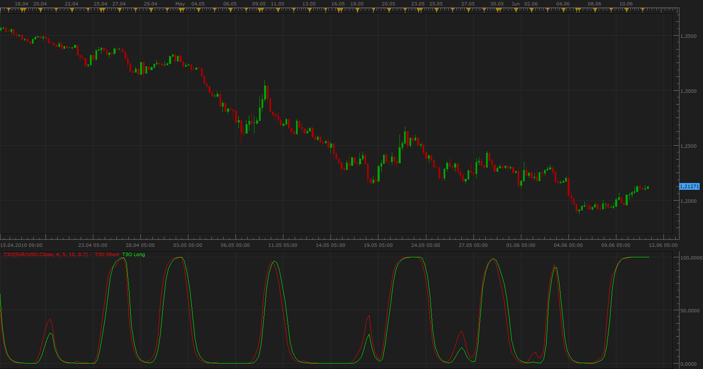

# Tilson T3 Oscillator

> Source: https://fxcodebase.com/code/viewtopic.php?f=17&t=1305  
> Forum: 17 · Topic 1305 · 4 post(s)

---

## Tilson T3 Oscillator

**Apprentice** · Fri Jun 11, 2010 9:06 am

*Tilson T3 Oscillator*

 [T3O.lua](files/2494/T3O.lua)

To work you need T3 moving average
[http://fxcodebase.com/code/viewtopic.php?f=17&t=1302&p=2496#p2487](https://fxcodebase.com/code/viewtopic.php?f=17&t=1302&p=2496#p2487)

Make sure to download, T3.lua version

The indicator was revised and updated

---

## Re: Tilson T3 Oscillator

**Apprentice** · Tue Dec 27, 2016 6:44 am

Indicator was revised and updated.

---

## Re: Tilson T3 Oscillator

**newton** · Wed Dec 28, 2016 11:54 am

hi apprendice,
can you create a strategy based on this indicator

**parameters:**

first t3 period :4
second t3 period 5
normalize period;10
volume factor;0.7

buy level; 20
sell level: 80

**buy: t3o short > t3o long and t3o long cross over buy level
sell: t3o short< t3o long and t3o long cross under sell level**

---

## Re: Tilson T3 Oscillator

**Apprentice** · Wed Dec 28, 2016 6:47 pm

Try this version.
[viewtopic.php?f=31&t=64253](https://fxcodebase.com/code/viewtopic.php?f=31&t=64253)
