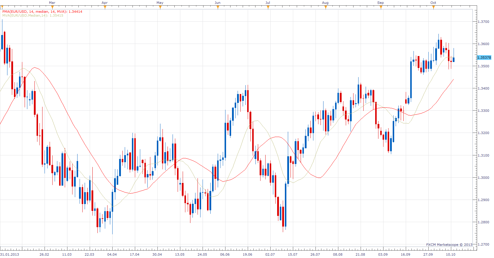

# Time Averaged MA

> Source: https://fxcodebase.com/code/viewtopic.php?f=17&t=59655  
> Forum: 17 · Topic 59655 · 6 post(s)

---

## Time Averaged MA

**Apprentice** · Sun Oct 13, 2013 2:26 am

If Period is set to 0, behaves like a classic moving average.
Otherwise "median", "typical", "weighted" will be calculated differently.

Example of "median"
Median= (max + min) / 2;
if Period is 0, max and min are the current period of high and low.
if Perid is 10, max and min are max and min of last 10 periods.

 [Time Averaged MA.lua](files/90010/Time%20Averaged%20MA.lua)

---

## Re: Time Averaged Price

**Apprentice** · Sun Oct 13, 2013 2:37 am

The same logic applies to Time averaged Price.
As Time averaged Price is a source for Time averaged MA.

 [Time Averaged Price.lua](files/90012/Time%20Averaged%20Price.lua)

---

## Re: Time Averaged MA

**Alexander.Gettinger** · Mon Dec 02, 2013 10:48 am

MQL4 version of Time Averaged price and MA: [viewtopic.php?f=38&t=60046](https://fxcodebase.com/code/viewtopic.php?f=38&t=60046).

---

## Re: Time Averaged MA

**oxbx99** · Tue Nov 03, 2015 3:45 am

Hi Alexander.Gettinger ,

Can you make these indicator to work on Tick chart please.

Thanks

---

## Re: Time Averaged MA

**Apprentice** · Tue Nov 03, 2015 5:49 am

Unfortunately can not be applied to tick charts.

---

## Re: Time Averaged MA

**Apprentice** · Thu Sep 27, 2018 5:55 am

The indicator was revised and updated.
