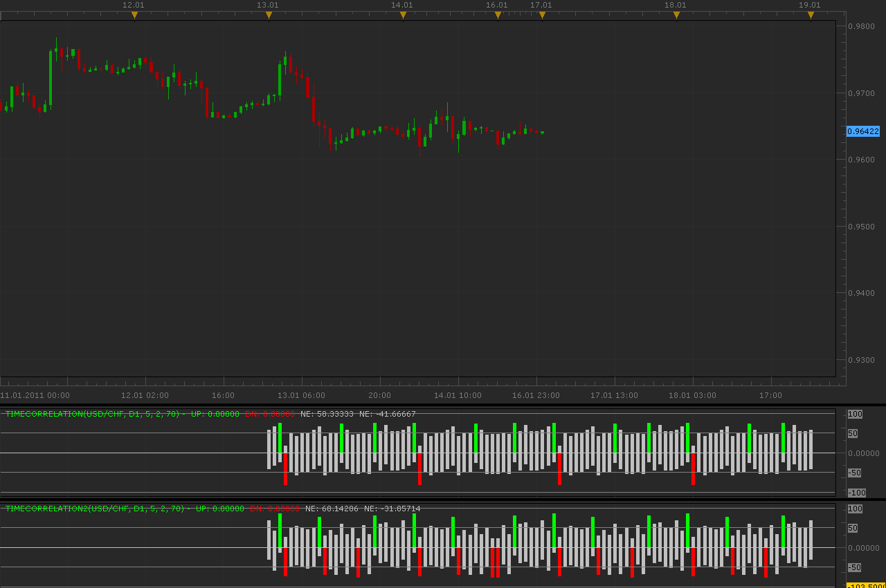

# Time correlation indicator

> Source: https://fxcodebase.com/code/viewtopic.php?f=17&t=3187  
> Forum: 17 · Topic 3187 · 5 post(s)

---

## Time correlation indicator

**Alexander.Gettinger** · Mon Jan 17, 2011 12:44 am

This indicator calculate what changed price in past and displays it.
For example, if main timeframe is H1 and timeframe in indicator is D1 indicator calculate what changed price at hour of each day. Positive value (close-open) is taken for +1, negative for -1. Results are drawn for [PeriodsBack] periods back and [PeriodsForward] periods forward.
Values smaller [Level] draws with neutral color.

Important!
Indicator use chart data only, not whole history.

 

Download:

 [TimeCorrelation.lua](files/7505/TimeCorrelation.lua)

In indicator "TimeCorrelation2" (close-open) not changed +1 or -1. Used source bar size.

Download:

 [TimeCorrelation2.lua](files/7505/TimeCorrelation2.lua)

I work on strategy on this indicator.

The indicator was revised and updated

---

## Re: Time correlation indicator

**craige** · Mon Jan 17, 2011 1:46 am

HELLO My Friend

I really don't konw how to use it, don't know how and what the bar represent?

could you explain in details whether this indicator can show us the signal for buy or sell?

thank you

---

## Re: Time correlation indicator

**CRAZYMOON** · Tue Jan 25, 2011 2:21 am

I am new to the site but i believe this is a great resource. My question us that when i run strategies using backtest I simply cant get a performance report. Like the sar strategy it does not have any trading parameters as with most other strategies. Am i doing something wrong or there is a way to put in trading parameters to get a performance report. I am using marketscope.

Thank you for your reply.

---

## Re: Time correlation indicator

**sunshine** · Tue Jan 25, 2011 7:58 am

Hi,
It seems that you use the SAR signal which cannot place orders. It just generates signals when the SAR indicator changes its direction.
Please do not hesitate to place a request for adding trading functions to this signal for fxcodebase developers:
[viewforum.php?f=27](https://fxcodebase.com/code/viewforum.php?f=27)
It's free but it may take some time.

---

## Re: Time correlation indicator

**Apprentice** · Fri Feb 17, 2017 10:09 am

Indicator was revised and updated.
