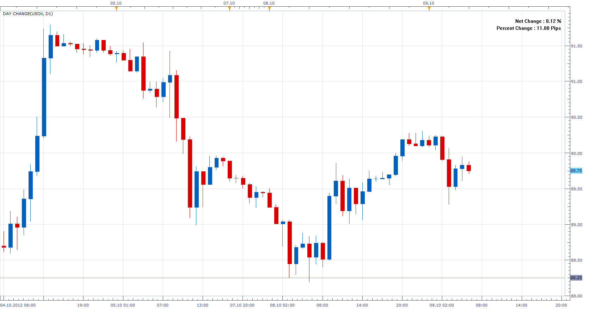

# Time Frame Change

> Source: https://fxcodebase.com/code/viewtopic.php?f=17&t=24220  
> Forum: 17 · Topic 24220 · 11 post(s)

---

## Time Frame Change

**Apprentice** · Tue Oct 09, 2012 5:14 am

Indicates the change in % or pips, from the beginning of the selected time frame
(not chart time frame)
By default time frame is set to D1.

 [Time Frame Change.lua](files/41666/Time%20Frame%20Change.lua)

The indicator was revised and updated

---

## Re: Time Frame Change

**nazaar** · Thu Oct 11, 2012 11:07 am

Hello, another good tool.

Is it possible to have it color coded? That is, if it's a negative change show the font in Red and if it's a positive change show the font in Green.

Thanks.

---

## Re: Time Frame Change

**Apprentice** · Thu Oct 11, 2012 1:51 pm

Try this Version

 [Time Frame Change.lua](files/41879/Time%20Frame%20Change.lua)

---

## Re: Time Frame Change

**nazaar** · Thu Oct 11, 2012 4:04 pm

> **Apprentice wrote:**
> Try this Version
>
> Time Frame Change.lua

Thank you.

---

## Re: Time Frame Change

**10daiFX** · Wed Jul 31, 2013 8:45 am

> **Apprentice wrote:**
> Try this Version
>
>
> Time Frame Change.lua

The % value doesn't change. Do you have an updated version?

---

## Re: Time Frame Change

**Apprentice** · Thu Aug 01, 2013 2:12 am

It work for me.
U are probably using a small time frame like "m1".

---

## Re: Time Frame Change

**Coondawg71** · Wed Feb 12, 2014 12:52 pm

Can we please add the option of "bottom center" to the options for display location.

thanks,

sjc

---

## Re: Time Frame Change

**Apprentice** · Fri Feb 14, 2014 4:14 am

Your request is added to the development list

---

## Re: Time Frame Change

**nookie** · Wed May 20, 2015 2:02 am

Can we have the same % change for tick volume that indicates the change in % ?

---

## Re: Time Frame Change

**Apprentice** · Fri May 22, 2015 3:59 am

U can use Tick Volume Percentage Change indicator.
[viewtopic.php?f=17&t=62242](https://fxcodebase.com/code/viewtopic.php?f=17&t=62242)

---

## Re: Time Frame Change

**Apprentice** · Sun Aug 13, 2017 5:47 am

The indicator was revised and updated.
