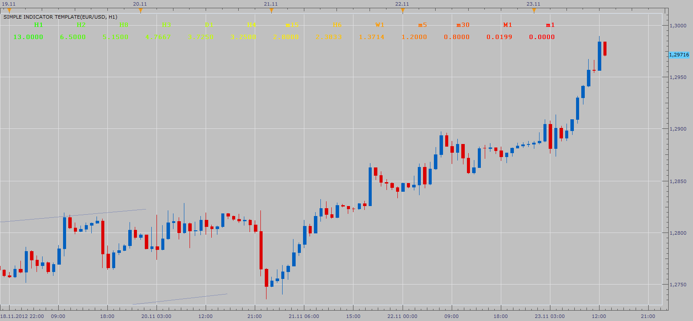

# Time Frame Volatility Comparison

> Source: https://fxcodebase.com/code/viewtopic.php?f=17&t=26549  
> Forum: 17 · Topic 26549 · 2 post(s)

---

## Time Frame Volatility Comparison

**Apprentice** · Fri Nov 23, 2012 2:21 pm

Indicator will first break down the volatility to the "m1" time frame,
after which it will calculate volatility projection for selected Time Frame.

The idea behind this idikatora.
To show to trader, relatively, what time frame is most volatile.

 [TFVC.lua](files/45554/TFVC.lua)

---

## Re: Time Frame Volatility Comparison

**Apprentice** · Mon Feb 19, 2018 8:33 am

The Indicator was revised and updated.
