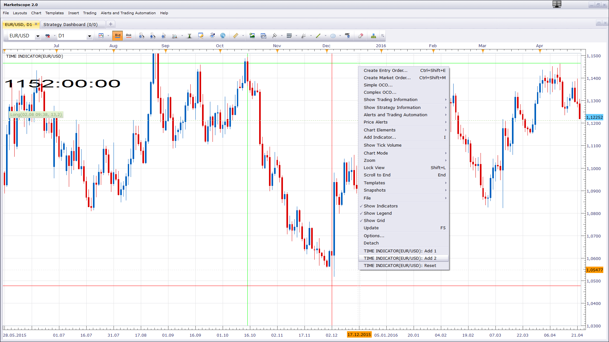

# Time indicator

> Source: https://fxcodebase.com/code/viewtopic.php?f=17&t=63724  
> Forum: 17 · Topic 63724 · 2 post(s)

---

## Time indicator

**Apprentice** · Tue Aug 02, 2016 10:50 am

 

Will show the time difference between two points,
in hours, minutes and seconds.

 [Time indicator.lua](files/107443/Time%20indicator.lua)

---

## Re: Time indicator

**Apprentice** · Fri Sep 14, 2018 5:45 am

The indicator was revised and updated.
