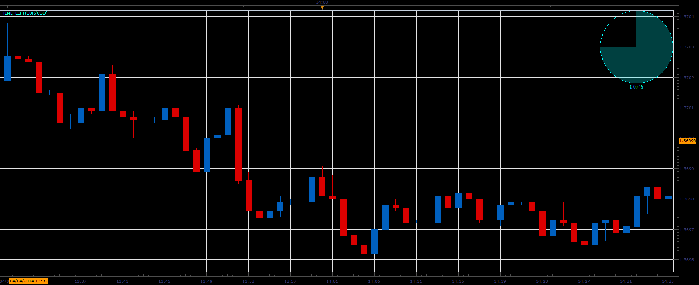

# Time left indicator

> Source: https://fxcodebase.com/code/viewtopic.php?f=17&t=60502  
> Forum: 17 · Topic 60502 · 20 post(s)

---

## Time left indicator

**Alexander.Gettinger** · Fri Apr 04, 2014 2:31 pm

The indicator shows the time remaining until the close of the last bar.

 

Download:

 [Time_Left.lua](files/93384/Time_Left.lua)

 [Time_Left times three.lua](files/93384/Time_Left%20times%20three.lua)

MT4 version
[https://fxcodebase.com/code/viewtopic.php?f=38&t=71500](https://fxcodebase.com/code/viewtopic.php?f=38&t=71500)

---

## Re: Time left indicator

**FxLowe** · Thu Sep 03, 2015 12:08 am

Hi. Thanks for the indicator.

Just want to let you know that there's a bug. Because the indicator is based on the operating system's clock, it doesn't work with any computer that is not set to the same timezone as the server.

Thanks again.

---

## Re: Time left indicator

**Apprentice** · Sun Sep 23, 2018 6:59 am

The indicator was revised and updated.

---

## Re: Time left indicator

**Silverthorn** · Thu Nov 15, 2018 3:25 am

Hi Apprentice,

Would I please be able to have a version of this indicator that displays 3 times instead of one. Either side by side or one on top of the other so the inner is one time the middle is the time traded and the outer is a larger time..

For example I trade the m5 chart and would like to see the m1, m5 and H1 times displayed.

Hope you can help.

Cheers!!

---

## Re: Time left indicator

**Apprentice** · Thu Nov 15, 2018 2:18 pm

Time_Left times three added.

---

## Re: Time left indicator

**Silverthorn** · Thu Nov 15, 2018 6:34 pm

Awesome!! Thank you.

---

## Re: Time left indicator

**Silverthorn** · Wed Dec 12, 2018 10:05 pm

> **FxLowe wrote:**
> Hi. Thanks for the indicator.
>
> Just want to let you know that there's a bug. Because the indicator is based on the operating system's clock, it doesn't work with any computer that is not set to the same timezone as the server.
>
> Thanks again.

To fix.

REPLACE

function now()
 if __debug__hook ~= nil then
 return core.host:execute("convertTime", core.TZ_EST, core.TZ_LOCAL, core.now());
 else
 return win32.currentTimeLocal();
 end
end

WITH

function now()
 return core.host:execute("convertTime", core.TZ_LOCAL, core.TZ_SERVER, win32.currentTimeLocal());
end

---

## Re: Time left indicator

**Silverthorn** · Thu Dec 13, 2018 8:41 pm

Hi Apprentice,

I'm not understanding the way time is calculated in TS V Marketscope.

Two things have me puzzled.

Firstly the changes I used in the post above only work in Marketscope to correctly set the time to count down for a new Daily candle appearing on the chart for the local machine reguardless of display time settings.

 

If you drag the same chart from Marketscope to TS the time to the end of the daily candle (Right Hand Clock) Changes from a count down to the next daily candle to a count down to 00.00 Server time again reguardless of local display time settings.

 

Can you explain how Marketscope and TS treat time differently and how to correctly work with time for time based Indicators / Strats. I assume that Strats use the time from Marketscope?

I'm also Not Understanding how the Time/Date is treated by Strats and Indicators in relation to Hourly and Daily Candles. A new Daily candle forms at 00.00 Server Time but the hourly candles Do not change to the new date until 9 hrs later.

 

How is this treated for example when using a MVA based on D1 as a filter for a Strat running on a H1 time frame using Local time? Does the Strat calculate start of the daily period correctly for Daily at Local time or is the Server time used as with the chart display?

Thanks for your help.

Cheers,
Mark

---

## Re: Time left indicator

**Silverthorn** · Fri Dec 14, 2018 12:16 am

OK Previous fix does not work.

The Server time for MS is not the same as for TS. At least not in Australia. The other problem I had was overcoming the Daylight Saving offset because I live in a time zone where there is Daylight Saving but our State does not observe it putting me out by one hour. The previous did seem to overcome that but just simply does not work in any other time zone or in Market Scope.

So. A better solution for me in Queensland Australia is simply to and add an offset to UTC time in min. If you are in a timezone that has Daylight Saving and you observe it or no Daylight Saving at all I think win32.currentTimeLocal() would work better.

If Daylight Saving gives you hell.

ADD TO INIT

 indicator.parameters:addInteger ("TIMESET", "TIME Offset", "Offset from UTC to Local Time in min.", 1);

REVISED NOW FUNCTION

function now()
 local TIMESET = instance.parameters.TIMESET;
 return win32.currentTimeUTC() - (TIMESET * 60 / 86400);
end

---

## Re: Time left indicator

**Apprentice** · Fri Dec 14, 2018 1:01 pm

Fixed.
Proposed solution is not correct as well.

---

## Re: Time left indicator

**Silverthorn** · Fri Dec 14, 2018 7:52 pm

Awesome!! Thanks Apprentice. Makes perfect sense and obviously works perfectly now. I've learned a lot from this process.

I notice in Version 2 that all the colens ; have been removed from the ends of lines of code. Can you please explain why the change in methodology?

---

## Re: Time left indicator

**Silverthorn** · Fri Dec 14, 2018 9:51 pm

Hi Apprentice,

It's not quite right yet.

m1 and m5 now display " -1:55:xx " for the first 60 seconds. m15 and up display correctly.

---

## Re: Time left indicator

**Silverthorn** · Sat Dec 15, 2018 9:36 pm

Ok That's bizarre!!

After the market feed "shut down for maintenance" for the weekend and reopened. All time frames are now displaying correctly.

Same chart has been open all the time. ????

---

## Re: Time left indicator

**Apprentice** · Mon Dec 17, 2018 5:24 am

Try it now.

---

## Re: Time left indicator

**fx1954** · Tue Aug 17, 2021 4:49 am

The time left indicator shows the time before the next cadle starts.
Is it possible to have the option that the indicator displays only the time left without displaying also the symbol of the clock.

---

## Re: Time left indicator

**Apprentice** · Wed Aug 18, 2021 1:15 pm

Your request is added to the development list.
Development reference 756.

---

## Re: Time left indicator

**Apprentice** · Mon Aug 23, 2021 2:25 am

FXTS2 has a build-in indicator for that: Show time till end

---

## Re: Time left indicator

**mancangkul** · Tue Sep 14, 2021 8:05 am

> **Alexander.Gettinger wrote:**
> The indicator shows the time remaining until the close of the last bar.
>
>
>
> Time_Left.PNG
>
>
>
> Download:
>
>
> Time_Left.lua
>
>
>
>
> Time_Left times three.lua

please convert to MT4....

---

## Re: Time left indicator

**Apprentice** · Tue Sep 14, 2021 8:41 am

Your request is added to the development list.
Development reference 825.

---

## Re: Time left indicator

**Apprentice** · Tue Sep 14, 2021 10:37 am

MT4 version
[https://fxcodebase.com/code/viewtopic.php?f=38&t=71500](https://fxcodebase.com/code/viewtopic.php?f=38&t=71500)
