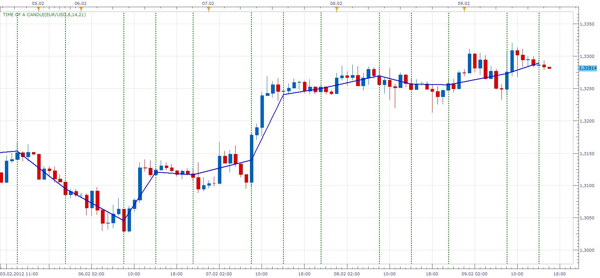

# Time of a candle

> Source: https://fxcodebase.com/code/viewtopic.php?f=17&t=11079  
> Forum: 17 · Topic 11079 · 57 post(s)

---

## Time of a candle

**Apprentice** · Fri Jan 06, 2012 5:34 am

This simple indicator, draw three vertical lines at specified times.

 [Time of a candle.lua](files/22604/Time%20of%20a%20candle.lua)

---

## Re: Time of a candle

**Apprentice** · Sat Jan 14, 2012 6:51 am

This simple indicator, draw three vertical lines at specified period Back or Onward from the current period.

 [Candle LookBack Period.lua](files/23420/Candle%20LookBack%20Period.lua)

If you want to draw line in the future, use a negative period.

---

## Re: Time of a candle

**Apprentice** · Thu Feb 09, 2012 4:18 pm

I have added a few requested features.
Now you can draw, Slope line, from one vertical line medina, to another

 [Time of a candle.lua](files/25579/Time%20of%20a%20candle.lua)

---

## Re: Time of a candle

**nazaar** · Fri Mar 09, 2012 11:48 am

Hi apprentice, how are you?

I have seen a few tools here which draw lines based on a selected hour, like the 2 tools above.

Is it possible to draw lines by **day of the week** and by day of the week plus a selected hour? For example, draw a vertical line for **Sunday**17:00 or **Monday**09:00?

thanks in advance.

---

## Re: Time of a candle

**Apprentice** · Sun Mar 11, 2012 4:55 am

Better, and I took a couple of days of sick leave.
Your request is added to the development list.

---

## Re: Time of a candle

**nazaar** · Mon Mar 12, 2012 11:47 am

Hi Apprentice, good to hear you're doing better.

to be able to draw the vertical line by day of the week, would you need to start over or can it be created by changing a few lines on the current coding? If yes, which line?

thanks.

---

## Re: Time of a candle

**Apprentice** · Tue Mar 13, 2012 3:05 am

Change is not complicated.
But I have to add a few new things.

---

## Re: Time of a candle

**Apprentice** · Tue Mar 13, 2012 3:59 am

Week of Day option added.

 [Time of a candle.lua](files/27970/Time%20of%20a%20candle.lua)

---

## Re: Time of a candle

**nazaar** · Tue Mar 13, 2012 7:50 pm

thanks very much apprenctice. it looks and works very well.

could you add Sunday? I like to draw weekly vertical lines on the 4 hour chart starting with the open of the market on Sunday.

thanks very much!

---

## Re: Time of a candle

**Apprentice** · Wed Mar 14, 2012 2:49 am

Sunday Added.

---

## Re: Time of a candle

**nazaar** · Wed Mar 14, 2012 5:23 pm

thank you!

---

## Re: Time of a candle

**Sepp64** · Sun Mar 18, 2012 10:08 am

Hello Apprentice,

Is it possible to to have the vertical lines automatically displayed on the current trading day only? And may be optional for the past day or X days ?

-So charts are not cluttered up with lines that hinder analyzing past price action.
-Changing Indicator every day to have only toady's lines available is not necessary.
-Charts would load faster. (at least I think so)

I would also be very Thankful if you could add 3 more lines to choose for each day for a total of 6 to the last version of the indicator "Time of a candle.lua".

Thanks a lot in advance!

---

## Re: Time of a candle

**Apprentice** · Mon Mar 19, 2012 1:07 am

Your request is added to the list of developers.

---

## Re: Time of a candle

**nazaar** · Thu Mar 22, 2012 7:07 pm

> **Apprentice wrote:**
> Week of Day option added.

Hello Apprentice, how are you?

This tool with the ability to draw weekly vertical lines has been very helpful. It has saved a lot of time. I can now quickly identify price action from 1 week to another on the lower time lines especially on the 4 hour chart.

Is it possible to add the option to have it draw vertical lines on the first day of the month? This way I can time dive the daily charts monthly.

thanks in advance.

---

## Re: Time of a candle

**Apprentice** · Fri Mar 23, 2012 4:15 am

[Time of a candle.lua](files/28539/Time%20of%20a%20candle.lua)

Try this one.
I also have add filter option, so that lines will be drawn on a larger time frame.
For example.
H1 will not be drawn on D1.

---

## Re: Time of a candle

**nazaar** · Fri Mar 23, 2012 2:40 pm

> **Apprentice wrote:**
>
>
> Time of a candle.lua
>
> Try this one, unfortunately, for some reason, does not work on time frames greater than D1.
> I also have add filter option, so that lines will be drawn on a larger time frame.
> For example. H1 will not be drawn on D1.

Hello Apprentice, thanks for working on this indicator.

 Any thoughts on how you can get the monthly start line to be drawn on the daily chart?

thanks.

---

## Re: Time of a candle

**Apprentice** · Sun Mar 25, 2012 4:24 am

I'm still in the dark with this one.

---

## Re: Time of a candle

**Apprentice** · Mon Mar 26, 2012 3:31 am

nazaar
problem has been solved.
now works on all timeframes.

---

## Re: Time of a candle

**nazaar** · Mon Mar 26, 2012 10:01 pm

> **Apprentice wrote:**
> nazaar, problem has been solved. now works on all timeframes.

thank you very much and as always I am grateful for your help.

---

## Re: Time of a candle

**nazaar** · Tue Mar 27, 2012 1:29 pm

Hi Apprentice, thanks so far for all your help.

on the monthly line, it is drawing a line on March 2nd instead of March 1st. Feb is the same thing, drawing a line on Feb 2nd instead of Feb 1st. Same for December, November and September but Oct is fine first trading day for the months was Oct 3rd.

January is fine as the first trading day was Jan 2nd.

Any thoughts?

---

## Re: Time of a candle

**nazaar** · Thu May 31, 2012 11:18 pm

> **Apprentice wrote:**
>
>
> Candle LookBack Period.png
>
>
> This simple indicator, draw three vertical lines at specified period Back or Onward from the current period.
>
>
> Candle LookBack Period.lua
>
>
>
> If you want to draw line in the future, use a negative period.

Hello Apprentice,

For the Candle LookBack Period Indicator, is it possible to give the user the option to choose whether to draw vertical line or place a marker at the x lookback period? This will help De-clutter the charts.

Thanks

---

## Re: Time of a candle

**Apprentice** · Fri Jun 01, 2012 3:27 am

In theory, yes.
Which marker you would like to use.
Colored candle or a symbol

---

## Re: Time of a candle

**nazaar** · Fri Jun 01, 2012 10:49 am

Hi Apprentice,

thanks for the quick response. I was thinking the same marker tool used here (MARKER.lua) :

[viewtopic.php?f=17&t=3963&hilit=marker](https://fxcodebase.com/code/viewtopic.php?f=17&t=3963&hilit=marker)

Symbol is preferred.

thanks

---

## Re: Time of a candle

**nazaar** · Wed Jul 11, 2012 7:34 am

> **Apprentice wrote:**
> In theory, yes.
> Which marker you would like to use.
> Colored candle or a symbol

Hi Apprentice, any update on this request?

Thanks.

---

## Re: Time of a candle

**MeiniOz** · Thu Oct 18, 2012 7:33 pm

I have taken the liberty to expand a bit on your code, Apprentice. Sorry nazaar, not what you were asking for

I changed it so that one can have any number of lines in a day (not just three). At the moment it is set to 24 but it can easily be changed to whatever is required, simply by modifying the number in the first line of the code using a text editor:

Code: [Select all](https://fxcodebase.com/code/)
`local n_LP = 24`A word of caution to the novice: the larger the number, the larger the menu will become, which, if very large, can have unpredictable effects.

Hope this is useful.

PS: I have also given it a different name.

---

## Re: Time of a candle

**MeiniOz** · Sun Oct 21, 2012 4:20 am

Option for arrow symbol added.

---

## Re: Time of a candle

**nazaar** · Wed Nov 07, 2012 3:20 pm

> **Apprentice wrote:**
>
>
> Time of a candle.png
>
>
> Week of Day option added.
>
>
> Time of a candle.lua

Hi Apprentice, could you add a quarterly and or yearly option?

Thanks very much.

---

## Re: Time of a candle

**Apprentice** · Fri Nov 09, 2012 6:57 am

Weekly, Quarterly and or Yearly option added.

 [Time of a candle.lua](files/44061/Time%20of%20a%20candle.lua)

---

## Re: Time of a candle

**nazaar** · Wed Jan 16, 2013 12:13 pm

> **Apprentice wrote:**
> This simple indicator, draw three vertical lines at specified times.
>
>
> Time of a candle.lua

Hi Apprentice, instead of drawing vertical lines at the specified times could you add the **option**to draw a wingding arrow instead with the option to adjust arrow size?

I tried doing it myself but could not get it to work right.

was using this:
"instance:createTextOutput ("Wingdings", instance.parameters.ArrowSize, core.H_Center, core.V_Bottom, instance.parameters, 0);"

---

## Re: Time of a candle

**Apprentice** · Thu Jan 17, 2013 8:45 am

Noted.
I need to see the whole code, in order to be able to help.
Please send it to my privat email.

---

## Re: Time of a candle

**Steven Smith** · Fri Jan 18, 2013 1:59 am

This simple indicator, draw three vertical lines at specified period Back or Onward from the current period.

---

## Re: Time of a candle

**Coondawg71** · Fri Jan 25, 2013 10:51 am

Can we please request another version of this type of indicator.

Minute Marker:

I would like a vertical line automatically plotted for a specific minute for every hour throughout the day.

I would like for example a vertical line plotted at 00:15 for every hour....8:15, 9:15, 10:15, etc.

Please allow user style preferences for color, thinckness and type of line.

Thanks,

sjc

---

## Re: Time of a candle

**Apprentice** · Tue Feb 12, 2013 3:26 pm

Your request is added to the development list.

---

## Re: Time of a candle

**Hailkayy** · Tue Feb 12, 2013 8:11 pm

Apprentice when you do that request, please insert the possibility to choose between horizontal line or vertical line, it will be a all-in-1 indicator.

---

## Re: Time of a candle

**xylary** · Mon Mar 04, 2013 11:17 pm

Hi Apprentice,

Could you please add an option so that this indicator can draw lines based on lunar calendar? For example, the indicator can draw a vertical line at the beginning of each lunar month. Thanks a lot!

Best,
xylary

---

## Re: Time of a candle

**Apprentice** · Tue Mar 05, 2013 6:58 am

Something like this.
[viewtopic.php?f=17&t=15090&p=28700&hilit=moon#p28700](https://fxcodebase.com/code/viewtopic.php?f=17&t=15090&p=28700&hilit=moon#p28700)
Note, I do not guarant for the accuracy of the moon phase algorithm.

---

## Re: Time of a candle

**xylary** · Wed Apr 03, 2013 7:03 pm

> **Apprentice wrote:**
> Something like this.
> [viewtopic.php?f=17&t=15090&p=28700&hilit=moon#p28700](https://fxcodebase.com/code/viewtopic.php?f=17&t=15090&p=28700&hilit=moon#p28700)
> Note, I do not guarant for the accuracy of the moon phase algorithm.

Thank you Apprentice! You are always so helpful.

---

## Re: Time of a candle

**Rachid** · Wed Sep 11, 2013 1:59 pm

Hi MeiniOz, could you add "TODAY" as an option in the DAY field and is it possible to set a set of N colors that should repeat each N+1 line ?

For ex: Color 1 for line 1 and color 2 for line 2 then color 1 once again for line 3 and color 2 for line 4 and so on...

Great job

Thanks very much

---

## Re: Time of a candle

**Jeffreyvnlk** · Thu Dec 12, 2013 10:52 am

> **Apprentice wrote:**
>
>
> Candle LookBack Period.png
>
>
> This simple indicator, draw three vertical lines at specified period Back or Onward from the current period.
>
>
> Candle LookBack Period.lua
>
>
>
> If you want to draw line in the future, use a negative period.

Sorry, this indicator not look onward from the current period

---

## Re: Time of a candle

**Apprentice** · Wed Jun 14, 2017 6:29 am

The indicator was revised and updated.

---

## Re: Time of a candle

**scandisk** · Mon Nov 27, 2017 1:03 am

Hi I wanted the days of week to extend out in time.

Thanks

---

## Re: Time of a candle

**Apprentice** · Mon Nov 27, 2017 12:25 pm

Can you show it on an example?

---

## Re: Time of a candle

**scandisk** · Thu Nov 30, 2017 12:18 pm

Hi Apprentice

I just need a very simple days of the week display that can be extended in time.. With just vertical lines that extend in the past and in the future.

So just time settings from a start time EST to a end time EST for the days. With option of weekends to be displayed..

Also line style, color and thickness to be adjustable.

 [19866](files/116294/Future-Vertical-Lines-Indicator.jpg)

Thanks

---

## Re: Time of a candle

**Apprentice** · Sat Dec 02, 2017 5:53 am

Your request is added to the development list under Id Number 3968

---

## Re: Time of a candle

**Apprentice** · Fri Dec 15, 2017 6:19 am

 [DaysWeekSeparator.lua](files/116472/DaysWeekSeparator.lua)

---

## Re: Time of a candle

**Apprentice** · Wed Mar 28, 2018 4:06 pm

The indicator was revised and updated.

---

## Re: Time of a candle

**Mountaintrader** · Fri Jun 17, 2022 3:55 pm

Hi Apprentice,

Please could a sound file be added to the DaysWeekSeparator.lua indicator that would trigger a .wav file to play at the allotted "Begin Time of the Day"

Regards
MT

---

## Re: Time of a candle

**Apprentice** · Mon Jun 20, 2022 11:34 am

We have added your request to the development list.
Development reference 369.

---

## Re: Time of a candle

**Apprentice** · Tue Sep 06, 2022 8:04 am

[DaysWeekSeparatorAlertSound.lua](files/147368/DaysWeekSeparatorAlertSound.lua)

Try this version.

---

## Re: Time of a candle

**Mountaintrader** · Sun Mar 05, 2023 10:00 am

Hi Apprentice,

In the "Begin time of day" field the indicator has the option to set the Hours and Minutes only.

Please could the option to set Seconds be added ?

Thanks

Mountaintrader

---

## Re: Time of a candle

**Apprentice** · Sun Mar 05, 2023 6:56 pm

We have added your request to the development list.
Development reference 217.

---

## Re: Time of a candle

**Mountaintrader** · Mon Mar 06, 2023 9:29 am

Hi Apprentice,

Please can I clarify its the "Time of a Candle with Alert" that I was requesting the "Seconds" be added. Apologies for including the wrong screenshot.

Thanks

Mountaintrader

---

## Re: Time of a candle

**Apprentice** · Mon Nov 06, 2023 5:26 am

[DaysWeekSeparatorAlertSound.lua](files/153190/DaysWeekSeparatorAlertSound.lua)

Try this version.

---

## Re: Time of a candle

**ahmedalhosenyy** · Wed Dec 06, 2023 12:02 pm

> **Apprentice wrote:**
>
>
> The attachment **Time of a candle.png** is no longer available
>
>
> Week of Day option added.
>
>
> The attachment **Time of a candle.png** is no longer available

Hello , May you make the vertical line = 12 line

it will help for drawing all ICT killzones

Thanks in advance

---

## Re: Time of a candle

**Apprentice** · Sun Dec 10, 2023 11:31 am

We have added your request to the development list.
Development reference 1101

---

## Re: Time of a candle

**ahmedalhosenyy** · Thu Feb 01, 2024 1:49 pm

Hello,

Any updates

also may you make it 10 sessions each with start and end lines " total 20 vertical lines" h:m

Thanks in advance

---

## Re: Time of a candle

**Apprentice** · Fri Jun 20, 2025 2:28 am

 [Time_of_a_candle.lua](files/159639/Time_of_a_candle.lua)
