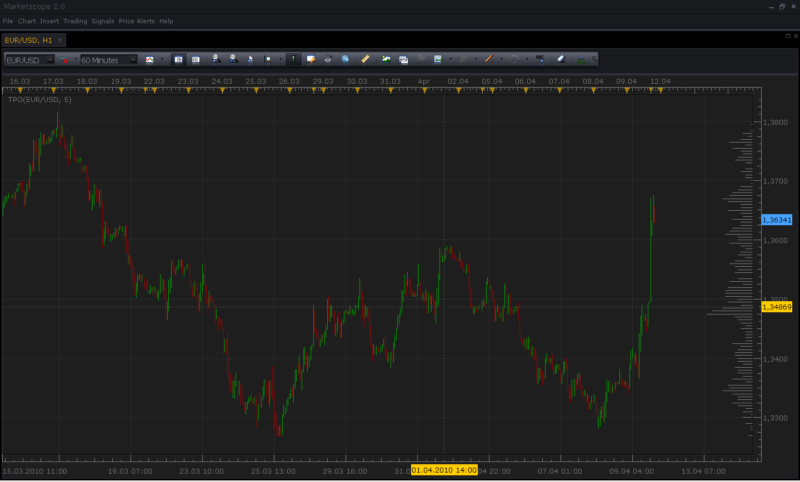

# Time Price Opportunity Profile

> Source: https://fxcodebase.com/code/viewtopic.php?f=17&t=604  
> Forum: 17 · Topic 604 · 9 post(s)

---

## Time Price Opportunity Profile

**Nikolay.Gekht** · Sun Apr 11, 2010 8:02 pm

The indicator shows how many times the median price of the bar appears during the whole loaded history.

 

Download the indicator:

 [TPO.lua](files/1072/TPO.lua)

 

 [TPO Price Heatmap.lua](files/1072/TPO%20Price%20Heatmap.lua)

---

## Re: Time Price Opportunity Profile

**thetruth** · Mon Aug 23, 2010 9:08 am

exelent! good work! can you transform this histogram to a line like the line in this link thanks!
[http://www.x-trader.net/articulos/siste ... ciona.html](http://www.x-trader.net/articulos/sistemas-de-trading/la-campana.-un-sistema-que-funciona.html)

---

## Re: Time Price Opportunity Profile

**Nikolay.Gekht** · Mon Aug 23, 2010 9:19 am

I think yes. However, have you the similar description on English? I'm afraid that using online translators would cause some misreadings.

---

## Re: Time Price Opportunity Profile

**thetruth** · Mon Aug 23, 2010 10:49 am

sorry, but i don´t have an english description, but, i tried to traslate the idea, i speak spanish, sorry for mistakes. the idea of this indicator is draw the center of histogram from some number of candles.

---

## Re: Time Price Opportunity Profile

**dlouisbriggs** · Thu Dec 16, 2010 8:37 am

Are you sure that the entire data history (max 300 bars) is utilized to display the TPO bars on the right? When I zoom the screen out, the TPO bars change according to the increased data history (candelsticks) being displayed.

---

## Re: Time Price Opportunity Profile

**Coondawg71** · Sun Aug 18, 2013 5:30 am

Can we please request this indicator to be updated with gradient coloring.

Perhaps we can fashion it similar to Better Volume version 2 indicator?
[search.php](https://fxcodebase.com/code/search.php)

or Rainbow Volume?
[viewtopic.php?f=17&t=26221&hilit=rainbow+volume](https://fxcodebase.com/code/viewtopic.php?f=17&t=26221&hilit=rainbow+volume)

If this is not feasible, please use your discretion on how to complete that task.

Thanks,

sjc

---

## Re: Time Price Opportunity Profile

**Apprentice** · Mon Aug 19, 2013 2:10 am

Your request is added to the development list.

---

## Re: Time Price Opportunity Profile

**Apprentice** · Mon Feb 05, 2018 10:49 am

The indicator was revised and updated.

---

## Re: Time Price Opportunity Profile

**Apprentice** · Wed Sep 05, 2018 5:42 am

TPO Price Heatmap.lua added.
