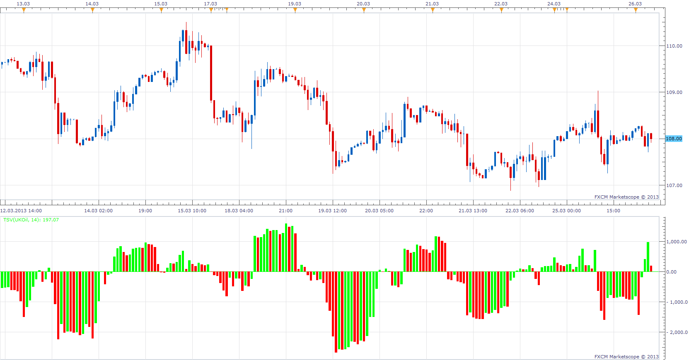

# Time Segmented Volume

> Source: https://fxcodebase.com/code/viewtopic.php?f=17&t=33848  
> Forum: 17 · Topic 33848 · 17 post(s)

---

## Time Segmented Volume

**Apprentice** · Tue Mar 26, 2013 6:24 am

Time Segmented Volume (TSV) is a technical indicator developed by Worden Brothers Inc.
Positiv TSV suggests accumulation or buying pressure,
Negativ TSV suggests distribution or selling pressure.

Positive or negative divergences between price and TSV suggests potential tops and bottoms.

 [TSV.lua](files/57449/TSV.lua)

MT4/MQ4 version
[viewtopic.php?f=38&t=65882](https://fxcodebase.com/code/viewtopic.php?f=38&t=65882)

---

## Re: Time Segmented Volume

**plkdtm** · Tue Mar 26, 2013 1:31 pm

whoua!!!!

as fast as bip bip !!!!

Ok i'll compare with the jforex one.

Thanks a lot

---

## Re: Time Segmented Volume

**plkdtm** · Tue Mar 26, 2013 3:10 pm

is it possible to change opacity of the candle?

---

## Re: Time Segmented Volume

**Apprentice** · Wed Mar 27, 2013 6:25 am

Bar Indicators can not have transparency.
Only ChannelGroup can have transparency.
Bollinger Band Waves is a good example.
[viewtopic.php?f=17&t=1373](https://fxcodebase.com/code/viewtopic.php?f=17&t=1373)

---

## Re: Time Segmented Volume

**Apprentice** · Wed May 10, 2017 5:43 am

Indicator was revised and updated.

---

## Re: Time Segmented Volume

**rshystbw** · Thu Apr 05, 2018 11:39 am

is it possible to convert to mql4 language?
thank you

---

## Re: Time Segmented Volume

**Apprentice** · Fri Apr 06, 2018 8:14 am

Your request is added to the development list.

---

## Re: Time Segmented Volume

**Apprentice** · Sat Apr 07, 2018 4:01 pm

MT4/MQ4 version
[viewtopic.php?f=38&t=65882](https://fxcodebase.com/code/viewtopic.php?f=38&t=65882)

---

## Re: Time Segmented Volume

**Kelly123** · Sat Jul 24, 2021 11:39 am

Hey Apprentice,
Can you add a selection of moving averages and also add divergence to the TSW.lua to show when price and the TSV is not agreeing and to draw on the TSV oscillator

Thanks in advance
K

 

---

## Re: Time Segmented Volume

**Apprentice** · Tue Jul 27, 2021 2:44 am

Your request is added to the development list.
Development reference 681.

---

## Re: Time Segmented Volume

**Apprentice** · Thu Jul 29, 2021 4:07 am

[TSV_with_divergence.lua](files/143013/TSV_with_divergence.lua)

Something like this?

---

## Re: Time Segmented Volume

**shaviv** · Thu Jul 29, 2021 11:28 am

kindly make it in TSV.mq4 also
thank you very much
TSV_with_divergence.mq4

---

## Re: Time Segmented Volume

**Apprentice** · Thu Jul 29, 2021 2:18 pm

Your request is added to the development list.
Development reference 704.

---

## Re: Time Segmented Volume

**Apprentice** · Wed Aug 04, 2021 4:35 am

Try this version.
[https://fxcodebase.com/code/viewtopic.php?f=38&t=65882](https://fxcodebase.com/code/viewtopic.php?f=38&t=65882)

---

## Re: Time Segmented Volume

**Kelly123** · Tue Sep 21, 2021 3:50 am

Hi Apprentice and Team,
Can you do a strategy using multiple timeframes trend time frame to use the TSV with divergences lua and the Trigger time frame to use the X-RSIOMA

SELL if the Trend TF crossed below the zero line and wait for the Trigger tf to be @ overbought and RSI crossed below ma enter short

BUY if the Trend TF crossed above the zero line and wait for the Trigger tf to be @ oversold and RSI crossed above ma enter long

Thanks
Kelly

---

## Re: Time Segmented Volume

**Apprentice** · Wed Sep 22, 2021 4:08 am

Your request is added to the development list.
Development reference 858.

---

## Re: Time Segmented Volume

**Apprentice** · Wed Sep 22, 2021 2:17 pm

I don't understand what indicator should cross the zero line at trend TF. What indicator should be at OS/OB?

Can you please write the complete specification?
