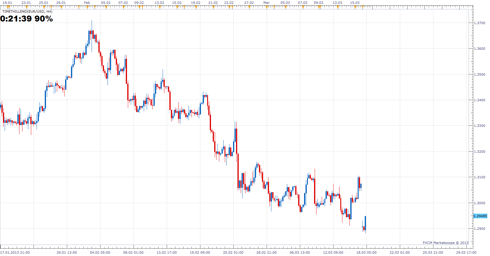
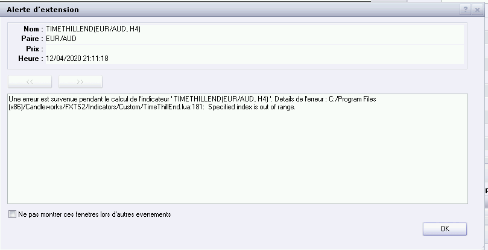
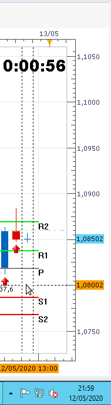
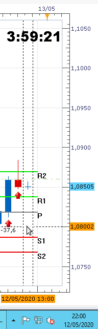

# Time to the end of the candle

> Source: https://fxcodebase.com/code/viewtopic.php?f=17&t=1973  
> Forum: 17 · Topic 1973 · 23 post(s)

---

## Time to the end of the candle

**Nikolay.Gekht** · Sat Aug 28, 2010 9:46 pm

The indicator shows the time (in hours:minutes:seconds) to the end of the current candle. The time is shown in the indicator label. The time is updated every second and disappears when candle is closed.

Please pay attention that the computer's clock must be synchronized! if the computer's clock has wrong date/time, the value shown by the indicator will be also wrong. To synchronize the clock automatically, go to the Settings->Control Panel->Date and Time, the choose "Internet Time" tab and set "Synchronize time with Internet servers".

Download:

 [TimeThillEnd.lua](files/3997/TimeThillEnd.lua)

 [TimeThillEnd with Alert.lua](files/3997/TimeThillEnd%20with%20Alert.lua)

This indicator provides Audio / Email Alerts on/ prior to Candle End.
Dec 12, 2015: Compatibility issue Fix. _Alert helper is not longer needed.

---

## Re: Time to the end of the candle

**thetruth** · Thu Jan 06, 2011 10:36 am

Great work!!!,
can you add some information??, i use this indicator, when you save a picture of the graphic
the picture do not have the information about the pair, and temporality.
Can you add, for example, in the legend of indicator, SHOWTIMETOEND(XXX/XXX)(TIME,%,PERIOD)??
Thanks,

---

## Re: Time to the end of the candle

**Timon55** · Thu Jan 06, 2011 1:54 pm

It looks like information about pair is already exist in the indicator's legend. You can find Indicator that also contain period in it's legend in the attached file.
Now legend's format is **SHOWTIMETOEND(XXX/XXX, Period)(TIME,%)**

---

## Re: Time to the end of the candle

**Thumper** · Sun Mar 17, 2013 9:36 pm

Can you include an option for size? That is the count down clock can be adjusted to be increase in size so the user can clearly see it.

---

## Re: Time to the end of the candle

**Apprentice** · Mon Mar 18, 2013 4:57 am

Adjustments implemented.

---

## Re: Time to the end of the candle

**Apprentice** · Mon Dec 23, 2013 10:27 am

TimeThillEnd Update.
TimeThillEnd with Alert Added.

---

## Re: Time to the end of the candle

**BTrade** · Mon Feb 09, 2015 5:55 am

Hi Apprentice,

Since the last software update this indicator is not working properly. For instance, on 5 minute timeframe it starts counting down from 7:15 to 2:15. Could you, please, fix the issue?

Thanks!

---

## Re: Time to the end of the candle

**Apprentice** · Tue Feb 10, 2015 5:15 am

Please test the revised version.

---

## Re: Time to the end of the candle

**BTrade** · Tue Feb 10, 2015 8:29 pm

Thanks!!

---

## Re: Time to the end of the candle

**Laventus** · Fri Oct 30, 2015 3:46 pm

Im having some troubles with the time to candle end indicator. If i change the chart to 1H timeframe, it shows the proper candle time to end. If I switch the time frame to say H8, the indicator displays a negative time.

1H chart: [https://gyazo.com/1fd4dc2840abdffa03f4737fadd16f1e](https://gyazo.com/1fd4dc2840abdffa03f4737fadd16f1e)
8H chart: [https://gyazo.com/a1f68720f9dcbbaafaf3feabede39012](https://gyazo.com/a1f68720f9dcbbaafaf3feabede39012)
My current clock settings. [https://gyazo.com/a6f85d1e21a0b3d9368c2e02c2ebb3ef](https://gyazo.com/a6f85d1e21a0b3d9368c2e02c2ebb3ef)

---

## Re: Time to the end of the candle

**Julia CJ** · Mon Nov 02, 2015 7:36 am

Hi Laventus,

Our developers will analyse the possible solutions for this issue. I will get back to you as soon as I have any feedback.

---

## Re: Time to the end of the candle

**Apprentice** · Sun Dec 13, 2015 1:15 am

Compatibility issue Fix. _Alert helper is not longer needed.

---

## Re: Time to the end of the candle

**Apprentice** · Mon Aug 06, 2018 1:49 pm

The indicator was revised and updated.

---

## Re: Time to the end of the candle

**Avignon** · Tue Apr 14, 2020 6:14 pm

Bug!

 

---

## Re: Time to the end of the candle

**Apprentice** · Wed Apr 15, 2020 1:08 pm

Try it now.

---

## Re: Time to the end of the candle

**Avignon** · Fri Apr 24, 2020 2:33 pm

Hello,

Bug fixed, thanks, but it's missing an hour.

I checked in the clock settings, the box "Synchronize time with Internet servers" is checked.

 

TF H1

 

TF H2

---

## Re: Time to the end of the candle

**Apprentice** · Mon Apr 27, 2020 9:13 am

Try it now.

---

## Re: Time to the end of the candle

**Avignon** · Mon Apr 27, 2020 5:10 pm

Still no good!

- from H2 to H8, the indicator displays the same value.

- secondary there is a 4 second delay between the 0 and the new candle.

---

## Re: Time to the end of the candle

**Apprentice** · Tue Apr 28, 2020 9:50 am

Your request is added to the development list.
Development reference 1162.

---

## Re: Time to the end of the candle

**Apprentice** · Thu Apr 30, 2020 4:33 am

Try it now.

---

## Re: Time to the end of the candle

**Avignon** · Thu Apr 30, 2020 5:48 pm

For hours and minutes it's good, however in local UT and at 21h00 this Thursday, April 30:

- day 9:00:00
- week 57:00:00
- month 9:00:00

---

## Re: Time to the end of the candle

**Avignon** · Wed May 13, 2020 6:19 am

*EURUSDH4-21:59*

 

*EURUSDH4-22:00*

No new candle was created. Time in France, set to New York time.

---

## Re: Time to the end of the candle

**fx1954** · Tue Aug 17, 2021 4:52 am

This indicator is not in sync with the server time. However, this is nessecary otherwise it will not work properly.
